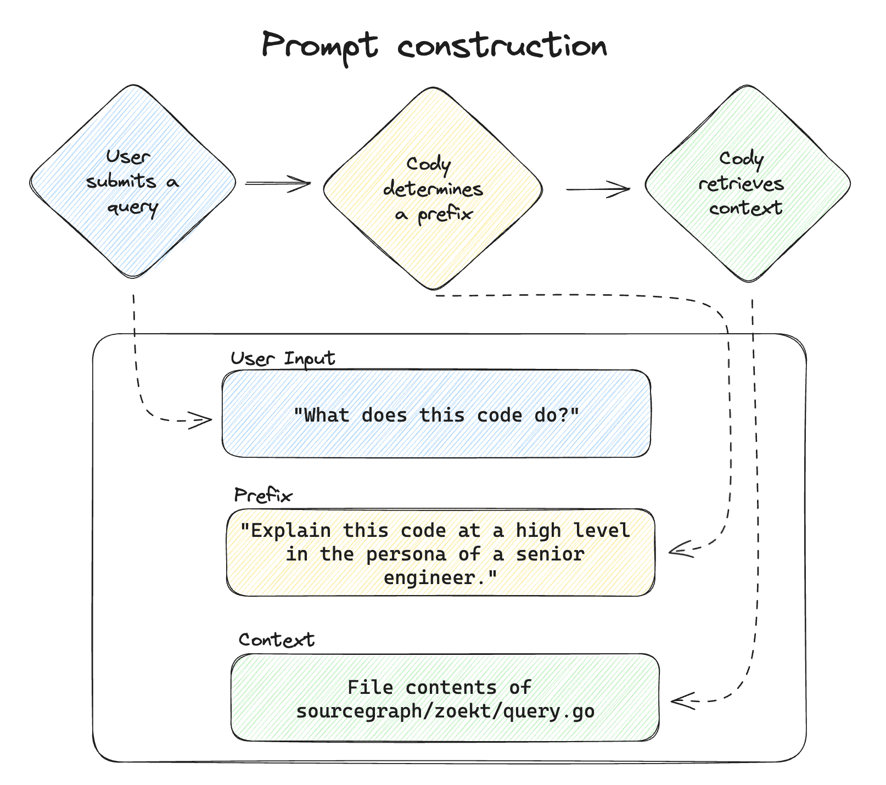

# 代码问答 Agent 示例

## 示例

### Cody

[How Cody understands your codebase](https://sourcegraph.com/blog/how-cody-understands-your-codebase)

### 提示词组成

#### 如何在提示中使用上下文

当用户通过聊天消息或命令向 Cody 查询时，Cody 首先会编译一个 prompt。Cody 将用户的输入整理成一个提示词，以便从大型语言模型（LLM）中获取最佳响应。
提示分为三部分：

1. **前缀（Prefix）**。描述所需输出的可选说明。Cody经常使用前缀，例如，当开发人员触发一个命令时，这个命令是预定义的任务，旨在返回特定的输出格式。例如，对于“Test”命令，Cody会使用前缀来定义输出格式为单元测试。
2. **用户输入（User input）**。用户提供的查询。
3. **上下文（Context）**。Cody查找并检索的附加信息，以帮助LLM提供相关答案。



#### 示例说明

例如，当用户触发 Cody 的 “Explain” 命令时，Cody生成的提示可能如下所示：

- **前缀**：
  ```
  Explain the following Go code at a high level. Only include details that are essential to an overall understanding of what's happening in the code.
  ```

- **用户输入**：
  ```
  zoekt.QueryToZoektQuery(b.query, b.resultTypes, b.features, typ)
  ```

- **上下文**：
  ```
  [Contents of sourcegraph/sourcegraph/internal/search/zoekt/query.go]
  ```

这个完整的提示，包括所有三部分内容，然后被发送到LLM。LLM根据提示中包含的信息以及其基线模型中的信息进行工作。任何有关用户代码库的问题，只有在上下文（作为提示的一部分发送）提供了足够的信息时，LLM才能回答。

#### 问答数据流


Cody在两种场景下的上下文构建方式不同，分别是聊天/命令和自动完成。

##### 聊天和命令

1. **广泛的上下文检索**：对于聊天和命令，Cody需要覆盖用户可能询问的整个代码库的广泛上下文。
2. **Sourcegraph代码智能平台**：Cody利用Sourcegraph的平台，该平台可以索引并理解来自多个存储库（从几个到超过10万个）的代码。
3. **搜索和上下文选择**：
    - **用户查询处理**：当用户调用Cody时，可以选择最多10个存储库。Cody会预处理用户查询，将其标记化并去除多余的信息。
    - **搜索引擎**：然后，这些标记由Sourcegraph的搜索引擎处理，扫描选定的存储库。
    - **相关性排名**：Cody使用改进的BM25排名函数和其他调整过的信号，根据搜索查询的相关性对文件片段进行排名。最相关的片段会被发送回Cody。
4. **本地上下文整合**：Cody还会整合用户IDE中打开文件的本地上下文，将这些与从Sourcegraph搜索中检索到的片段结合起来。
5. **全局排名和提示构建**：Cody对所有片段进行全局排名，并根据长度选择最相关的片段来构建提示的上下文。这个上下文连同用户输入一起被发送到LLM（大语言模型）以生成响应。

##### 自动补全
             
自动补全：

1. **速度和本地上下文优先**：自动补全需要非常快，优先考虑本地上下文而不是远程搜索。
2. **意图解析**：使用Tree-Sitter，Cody 解析用户的输入以确定最相关的完成体验，无论是填充函数体、编写文档字符串还是实现方法调用。
3. **本地上下文检索**：Cody 从各种本地来源（如活动文件、其他打开的标签页和最近关闭的标签页）检索上下文。
4. **上下文打包和补全**：它识别相关的代码段，将最相关的片段打包成一个提示。这提示被发送到一个针对完成任务优化的 LLM，生成的建议会作为虚拟文本显示在用户光标前。

##### Embeddings 转变

Cody最初使用 Embeddings（高维数据的密集向量表示）来检索上下文，但由于几个缺点而放弃了：

- **数据隐私**：将代码发送到 OpenAI 进行处理存在隐私问题。
- **维护复杂性**：创建和更新嵌入增加了 Sourcegraph 管理员的复杂性。
- **可扩展性**：处理大型代码库（超过10万个存储库）的嵌入非常耗费资源，限制了多存储库上下文功能的构建。

新系统利用 Sourcegraph 的本地平台，避免了这些问题，因为不需要外部处理，也不需要额外配置，并且可以更有效地扩展。然而，Embeddings
可能在未来改进中继续探索。
