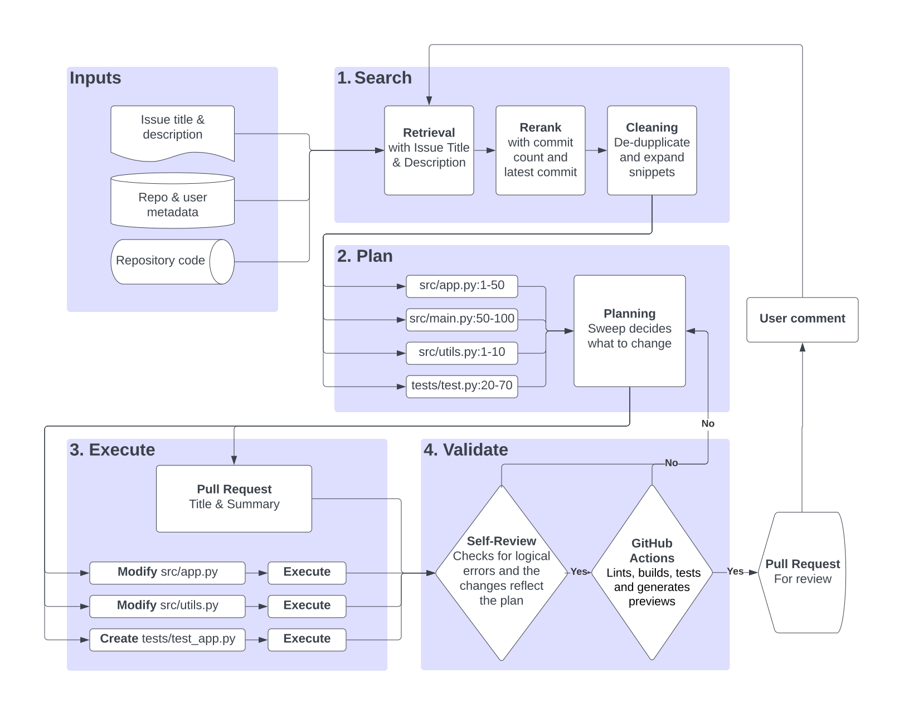

# 代码问答 Agent 示例

## 示例

### Sweep：issue-to-pull-request



Sweep 的核心算法可以总结为以下四个主要阶段：

1. **搜索**：
    - **目的**：检索相关的代码片段和上下文。
    - **过程**
      ：根据问题描述查询代码库，获取顶级代码片段。使用 [MPNet](https://huggingface.co/sentence-transformers/all-mpnet-base-v2)
      向量化和 DeepLake 向量存储。
    - **步骤**：
        - 根据问题上下文搜索代码片段。
        - 重排。基于提交计数和最新提交时间的启发式方法对片段进行重新排序
        - 去重和合并代码片段。
        - 使用 [ctag 总结生成仓库摘要](https://docs.sweep.dev/blogs/understanding-codebase-with-ctags)。

2. **规划**：
    - **目的**：确定修改和新创建的文件。
    - **过程**：分析问题的根本原因并规划变更。
    - **步骤**：
        - 使用自然语言规划实现方案。
        - 指定要修改或创建的文件。
        - 根据需要验证和调整修改方案。

3. **执行**：
    - **目的**：在代码库中实施规划的变更。
    - **过程**：
        - 创建新文件或修改现有文件。
        - 辨识并描述具体变更及其涉及的行号。
        - 使用搜索和替换对进行修改。
        - 对于大文件使用流式方法处理。

4. **验证**：
    - **目的**：确保实施变更的正确性。
    - **过程**：
        - 使用基于LLM和程序的验证检查代码错误和功能。
        - 进行自我审查，必要时进行迭代。
        - 利用GitHub Actions进行额外的验证。

从搜索代码片段到验证变更的每个阶段都确保了一种系统化的方法，通过自动化流程和GPT-4驱动的类人推理来进行代码修改和创建。

### Cody

[How Cody understands your codebase](https://sourcegraph.com/blog/how-cody-understands-your-codebase)

#### 如何在提示中使用上下文

当用户通过聊天消息或命令向 Cody 查询时，Cody 首先会编译一个 prompt。Cody 将用户的输入整理成一个提示词，以便从大型语言模型（LLM）中获取最佳响应。
提示分为三部分：

1. **前缀（Prefix）**。描述所需输出的可选说明。Cody经常使用前缀，例如，当开发人员触发一个命令时，这个命令是预定义的任务，旨在返回特定的输出格式。例如，对于“Test”命令，Cody会使用前缀来定义输出格式为单元测试。
2. **用户输入（User input）**。用户提供的查询。
3. **上下文（Context）**。Cody查找并检索的附加信息，以帮助LLM提供相关答案。


#### 示例说明

例如，当用户触发 Cody 的 “Explain” 命令时，Cody生成的提示可能如下所示：

- **前缀**：
  ```
  Explain the following Go code at a high level. Only include details that are essential to an overall understanding of what's happening in the code.
  ```

- **用户输入**：
  ```
  zoekt.QueryToZoektQuery(b.query, b.resultTypes, b.features, typ)
  ```

- **上下文**：
  ```
  [Contents of sourcegraph/sourcegraph/internal/search/zoekt/query.go]
  ```

这个完整的提示，包括所有三部分内容，然后被发送到LLM。LLM根据提示中包含的信息以及其基线模型中的信息进行工作。任何有关用户代码库的问题，只有在上下文（作为提示的一部分发送）提供了足够的信息时，LLM才能回答。

#### 问答数据流


Cody在两种场景下的上下文构建方式不同，分别是聊天/命令和自动完成。

##### 聊天和命令

1. **广泛的上下文检索**：对于聊天和命令，Cody需要覆盖用户可能询问的整个代码库的广泛上下文。
2. **Sourcegraph代码智能平台**：Cody利用Sourcegraph的平台，该平台可以索引并理解来自多个存储库（从几个到超过10万个）的代码。
3. **搜索和上下文选择**：
    - **用户查询处理**：当用户调用Cody时，可以选择最多10个存储库。Cody会预处理用户查询，将其标记化并去除多余的信息。
    - **搜索引擎**：然后，这些标记由Sourcegraph的搜索引擎处理，扫描选定的存储库。
    - **相关性排名**：Cody使用改进的BM25排名函数和其他调整过的信号，根据搜索查询的相关性对文件片段进行排名。最相关的片段会被发送回Cody。
4. **本地上下文整合**：Cody还会整合用户IDE中打开文件的本地上下文，将这些与从Sourcegraph搜索中检索到的片段结合起来。
5. **全局排名和提示构建**：Cody对所有片段进行全局排名，并根据长度选择最相关的片段来构建提示的上下文。这个上下文连同用户输入一起被发送到LLM（大语言模型）以生成响应。

##### 自动补全

自动补全：

1. **速度和本地上下文优先**：自动补全需要非常快，优先考虑本地上下文而不是远程搜索。
2. **意图解析**：使用Tree-Sitter，Cody 解析用户的输入以确定最相关的完成体验，无论是填充函数体、编写文档字符串还是实现方法调用。
3. **本地上下文检索**：Cody 从各种本地来源（如活动文件、其他打开的标签页和最近关闭的标签页）检索上下文。
4. **上下文打包和补全**：它识别相关的代码段，将最相关的片段打包成一个提示。这提示被发送到一个针对完成任务优化的
   LLM，生成的建议会作为虚拟文本显示在用户光标前。

##### Embeddings 转变

Cody最初使用 Embeddings（高维数据的密集向量表示）来检索上下文，但由于几个缺点而放弃了：

- **数据隐私**：将代码发送到 OpenAI 进行处理存在隐私问题。
- **维护复杂性**：创建和更新嵌入增加了 Sourcegraph 管理员的复杂性。
- **可扩展性**：处理大型代码库（超过10万个存储库）的嵌入非常耗费资源，限制了多存储库上下文功能的构建。

新系统利用 Sourcegraph 的本地平台，避免了这些问题，因为不需要外部处理，也不需要额外配置，并且可以更有效地扩展。然而，Embeddings
可能在未来改进中继续探索。

### Aider - 仓库映射提供上下文

aider 的最新版本会随每个修改请求向 GPT 发送一个仓库映射。这个映射包含仓库中所有文件的列表，以及每个文件中定义的符号。像函数和方法这样的可调用对象还包括它们的签名。

- GPT 可以看到仓库中所有地方的变量、类、方法和函数签名。仅此一项可能已经为其提供了足够多的上下文来解决许多任务。例如，它可能可以仅基于映射中显示的细节来理解如何使用模块导出的
  API。
- 如果需要查看更多代码，GPT 可以使用映射自行确定需要查看的文件。然后，GPT 将要求查看这些特定文件，而 aider
  将自动将它们添加到对话上下文中（经过用户批准）。

当然，对于大型代码库，即使仅仅映射可能也太大了以至于超出上下文窗口的能力。然而，这种映射方法扩展了与 GPT-4
在比以往更大的代码库上合作的能力。它还减少了手动选择要添加到对话上下文中的文件的需要，使 GPT 能够自主识别与当前任务相关的文件。

#### ：Ctags 到  TreeSitter

[Improving GPT-4’s codebase understanding with ctags](https://aider.chat/docs/ctags.html)

tree-sitter 仓库映射取代了 aider 最初使用的基于 ctags 的映射。从 ctags 切换到 tree-sitter 带来了许多好处：

- 映射更丰富，直接显示源文件中的完整函数调用签名和其他详细信息。
- 借助 py-tree-sitter-languages，我们通过一个 python 包获得了对许多编程语言的全面支持，该包在正常的 pip 安装 aider-chat 的过程中自动安装。
- 我们消除了用户通过某些外部工具或软件包管理器（如 brew、apt、choco 等）手动安装 universal-ctags 的要求。
- Tree-sitter 集成是实现 aider 未来工作和能力的关键基础。

一些可能减少映射数据量的方法包括：

- 精简全局映射，优先考虑重要符号并丢弃“内部”或其他全局不相关的标识符。可能可以借助 gpt-3.5-turbo 在灵活且与语言无关的方式中进行这种精简。
- 提供机制让 GPT 从精简的全局映射子集开始，并允许它要求查看其感觉与当前编码任务相关的子树或关键词的更多细节。
- 尝试分析用户给出的自然语言编码任务，并预测什么样的仓库映射子集是相关的。在特定的仓库内进行先前编码对话的分析可能有助于此工作。针对
  chat history、仓库映射或代码库的向量和关键字搜索可能有所帮助。

一个关键目标是优先选择语言无关或可以轻松部署到大多数流行编程语言的解决方案。ctags 解决方案具有这种优势，因为它预先支持大多数流行语言。我怀疑语言服务器协议可能比
ctags 更适合这个问题。但是，对于广泛的语言，它的部署可能更为繁琐。用户可能需要为他们感兴趣的特定语言搭建一个 LSP 服务器。

