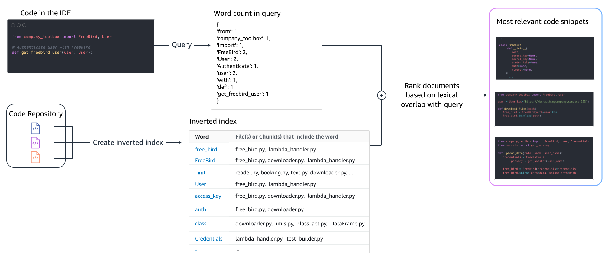

# 编码智能体：本地 AI 智能体


### JetBrains

#### Function Calling

    The function presented serves as a comprehensive search utility within JetBrains IDEs,
    It behaves like exact_search.
    The only difference is that this function allows not exact queries, as search is embedding-based in this case
    Use this function, IF YOU DO NOT KNOW THE **EXACT** NAME the named entity you are looking for OR if exact_search failed.",
    
    ```json
    {
        "type": "object",
        "properties": {
            "searchType": {
                "type": "string",
                "enum": ["actions", "symbols", "classes", "files"]
            },
            "query": {
                "type": "string",
                "description": "Query in textual form for searching by entity names."
            }
        },
        "required": ["searchType", "query"]
    }
    ```

exact_search:

```markdown
This function serves as a robust search tool in JetBrains IDEs, allowing you to find  IDE actions (like \"save file\", \"open file\"),
symbols (functions, classes, methods), specific classes, and files containing project info like README.md. 
The search is based on the exact names of these entities, not their content, so craft your search queries accordingly.

Use this function if the exact name of what you're searching for is available, and fallback to semantic_search if unsure or unsuccessful.
In general PREFER this function over semantic_search, as the second one is more expensive. (for example if user specifies the exact class name like \"what does class <CLASS_NAME> do\")

It provides a list of search results and their IDs and could return content for short results. Avoid mentioning IDs in the response.
```

### 示例：AutoDev for VSCode


### 示例：Amazon Q [迁移 Agent](https://aws.amazon.com/cn/q/developer/code-transformation/)

- [Upgrading language versions with the Amazon Q Developer Agent for code transformation](https://docs.aws.amazon.com/amazonq/latest/qdeveloper-ug/code-transformation.html)
- [Modernize your Java application with Amazon Q Developer](https://aws.amazon.com/cn/blogs/devops/modernize-your-java-application-with-amazon-q-developer/)

### [自定义代码库](https://aws.amazon.com/cn/blogs/aws/customize-amazon-q-developer-in-your-ide-with-your-private-code-base/)

[Customizing coding companions for organizations](https://aws.amazon.com/cn/blogs/machine-learning/customizing-coding-companions-for-organizations/)

Indexing


Algorithms



语义检索 [[Contriever](https://arxiv.org/pdf/2112.09118.pdf), [UniXcoder](https://arxiv.org/pdf/2203.03850.pdf)] _–_
将查询和索引的代码片段转换为高维向量，并基于语义相似性对代码片段进行排序。正式来说，通常使用[k近邻 (KNN) 或近似最近邻 (ANN)](https://arxiv.org/abs/2101.12631)
搜索来找到其他具有相似语义的片段。

Semantic retrieval 过程


其它相关：

- [MinJoin: Efficient Edit Similarity Joins via Local Hash Minima](https://arxiv.org/abs/1810.08833)
- [CodeBLEU: a Method for Automatic Evaluation of Code Synthesis](https://arxiv.org/abs/2009.10297)

