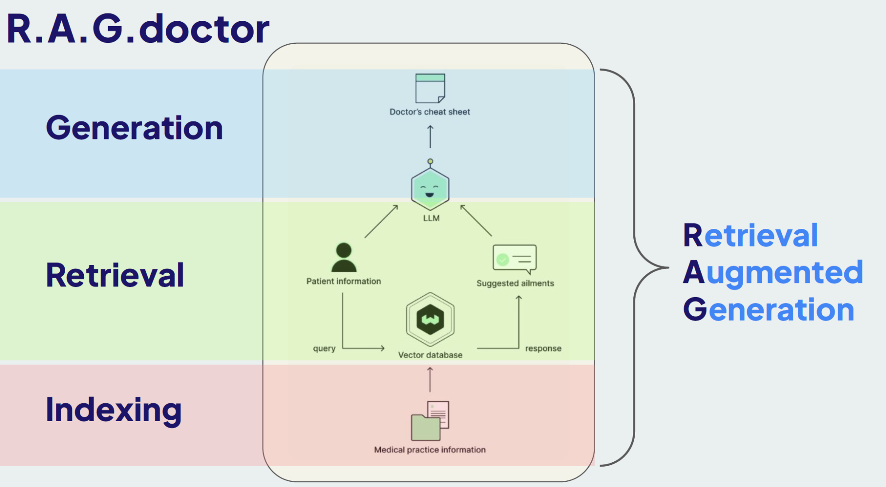
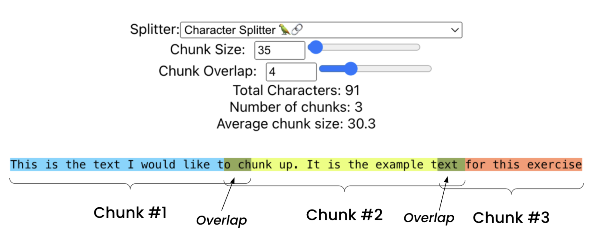
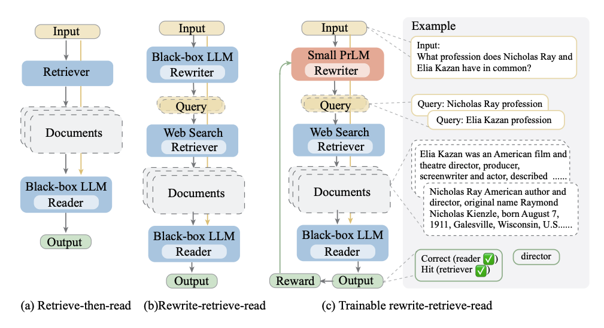
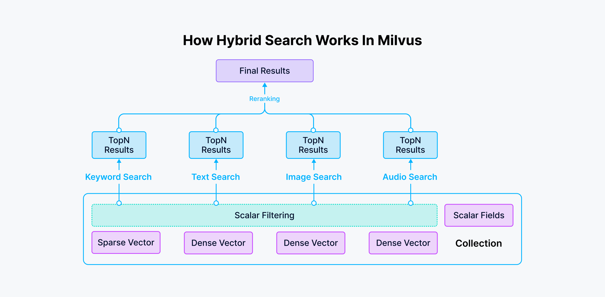
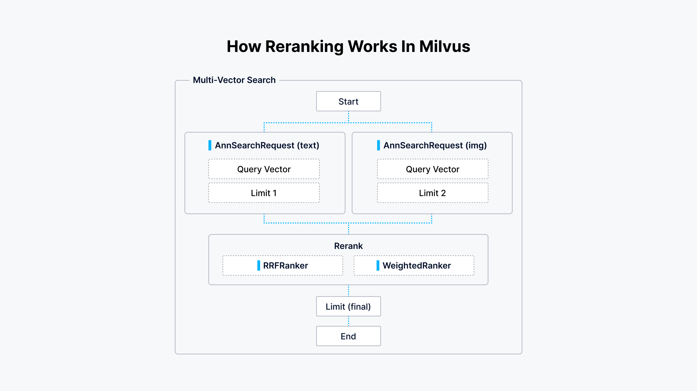
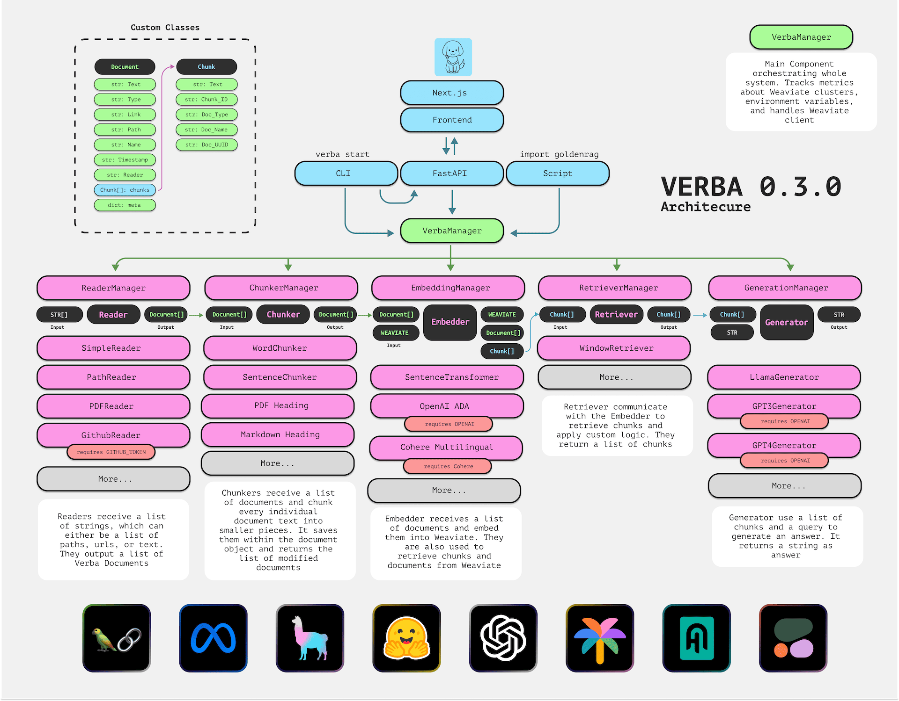

# 编码智能体：理解 RAG 的应用

RAG 示例



## RAG 过程

[Advanced RAG Techniques](https://weaviate.io/blog/advanced-rag)

### Indexing - textChunking

有效的索引对于任何 RAG 系统来说都至关重要。第一步涉及如何摄取、分块和存储数据。

#### 简单文本 Chunking

- 概述：这种方法将文档按固定大小进行分块，并带有一些重叠。这确保每个块保留前一个块的上下文。
- 实现：可以指定一个块大小（例如 35 个字符）和一个重叠大小以在块之间保持上下文。此方法适用于简单文档，但可能不适用于更复杂的文本，也无法利用文档结构。
- 优缺点：实现简单，但可能会打断语义单元，导致块不连贯，从而降低检索性能。



详细代码：[RetrievalTutorials](https://weaviate.io/blog/advanced-rag)

#### 特定文档 Chunking

#### 语义化 Chunking

- 概述：语义分块是基于意义而不是固定大小来划分文本。这种技术确保每个块代表一个连贯的信息片段。
- 实现：计算句子嵌入之间的余弦距离。如果两个句子在语义上相似（低于某个阈值），它们属于同一个块。这种方法根据内容的语义结构创建可变长度的块。
- 优缺点：产生更连贯和语义上有意义的块，提高检索准确性，但需要通过基于 BERT 的编码器模型进行前向传播，这比简单分块更具计算密集型。


#### 基于图（抽象语法树）的 Chunking

- 概述：这种方法使用抽象语法树（AST）来分块文本。AST 是代码的结构化表示，可以帮助识别代码块的边界。
- 实现：使用 AST 解析代码，识别代码块的开始和结束。这种方法适用于代码文本，因为代码通常具有结构化的语法。
- 优缺点：生成高质量的块，但需要专门的代码解析器，适用于代码文本，不适用于自然语言文本。

#### 基于 LLM 的 Chunking

- 概述：这种高级方法使用语言模型从文本中创建自包含的命题，确保每个块在语义上是完整的。
- 实现：使用一个语言模型（例如一个拥有 70 亿参数的模型）处理文本，将其分解为独立有意义的命题。然后模型将这些命题组合成块，平衡语义完整性和上下文。这种方法计算密集，但提供最高的准确性。
- 优缺点：适应文本细微差别，生成高质量的块，但计算密集，并且可能需要针对特定应用进行微调。

示例：https://huggingface.co/chentong00/propositionizer-wiki-flan-t5-large

#### 基于 Agentic 的 Chunking

示例：[AgenticChunker](https://github.com/FullStackRetrieval-com/RetrievalTutorials/blob/a4570f3c4883eb9b835b0ee18990e62298f518ef/tutorials/LevelsOfTextSplitting/agentic_chunker.py)

### Indexing -结合元数据

元数据提供了额外的上下文，可以显著提高检索的准确性。通过整合日期、患者年龄和既往病史等元数据，可以在搜索过程中过滤掉无关信息。过滤有助于缩小搜索范围，使检索过程更加高效和相关。

#### 添加和基于元数据的过滤

**概述**：元数据提供了额外的上下文，可以显著提高检索的准确性。通过整合日期、患者年龄和既往病史等元数据，可以在搜索过程中过滤掉无关信息。过滤有助于缩小搜索范围，使检索过程更加高效和相关。

**实现**：在索引数据时，将元数据与矢量化文本一起存储。例如，如果索引患者记录，包含元数据如年龄、就诊日期和特定病情。在搜索时使用这些元数据过滤搜索结果，确保系统只检索相关信息。

例如，如果查询与儿科患者有关，首先过滤掉18岁以上患者的记录，然后再执行语义搜索。这减少了检索结果中的噪音，增强了输出的相关性。


参考：[MyScale](https://medium.com/@myscale/optimizing-filtered-vector-search-in-myscale-77675aaa849c)

#### 使用GLiNER为分块生成元数据

有时你可能没有丰富的元数据来增强你的分块，但使用GLiNER（通用线性命名实体识别器）模型可以实时从分块中生成元数据！GLiNER是一个基于BERT的强大模型，可以在摄取阶段对分块进行标记和标签创建元数据，从而显著改善检索过程。

**自动标记与GLiNER**：

**实现**：你可以将每个分块和你想要识别的标签一起提供给GLiNER。如果在分块文本中找到这些标签，它将识别它们；如果没有匹配到高置信度的内容，则不会生成标签，从而减少误报。

**优缺点**：对于一般用途效果很好，但可能需要针对特定领域的数据集和应用进行微调。

**查询解析和过滤**：

**实现**：GLiNER的另一个用途是解析传入的查询，并将其与标记的元数据匹配以过滤结果。

**优缺点**：通过确保上下文相关性提高了检索准确性，但增加了一个额外的处理步骤。

参考：GLiNER:
通用命名实体识别模型使用双向变压器。示例：[GLiNER Demo](https://huggingface.co/spaces/urchade/gliner_multiv2.1)

这些技术为建立一个强大的RAG系统奠定了基础，使得从大数据集中进行高效检索成为可能。选择哪种分块方法和如何使用元数据将取决于你的数据集的具体需求和特性。

### Retrieval：提高矢量数据库检索召回率

为了增强RAG（Retrieval-Augmented Generation）系统中的检索部分，可以采用以下几种技术来显著提高与查询相关的文档召回率，从而提高LLM（大语言模型）生成高质量结果的几率：

#### 1. 混合搜索

混合搜索结合了矢量搜索和关键词搜索的优势，以提高检索的准确性。

- **矢量搜索**：捕捉查询的语义含义。
- **关键词搜索**：识别特定术语的精确匹配。

在医学等领域，许多术语和概念并不是通过语义理解的，而是特定的关键词，如药物名称、解剖术语、疾病名称和诊断。纯粹的矢量搜索可能会遗漏这些关键字，而基于关键词的搜索确保了特定重要术语被考虑在内。通过整合这两种方法，混合搜索允许更全面的检索过程。

这两种搜索方法（矢量和关键词搜索）并行运行，然后根据加权系统合并和排序结果。例如，使用Weaviate，可以调整alpha参数以平衡矢量与关键词搜索结果的重要性，创建一个综合的、排序的文档列表。这种方法平衡了精度和召回率，改善了整体检索质量，但需要仔细调整加权参数。

#### 2. 查询重写

查询重写考虑到人类查询可能并不适合矢量数据库或语言模型。通过利用语言模型重写查询，可以显著改善检索过程。

- **矢量数据库的查询重写**：将患者的初始查询转换为更适合数据库的格式。例如，将“我的左肩疼痛，拇指和食指麻木”重写为“左肩疼痛。麻木。食指麻木”。
- **语言模型的提示重写**：自动和互动式地构建提示以优化与语言模型的交互，提升生成结果的质量和准确性。框架如DSPy可以帮助实现这一过程。

这些重写的查询和提示确保检索过程更好地理解和检索相关文档，并优化语言模型的提示。可以通过以下方式实现查询重写：

**示例**：

- 初始查询：My left shoulder hurts and I have numbness in my thumb and index finger.
- 重写查询：Pain left shoulder. Numbness. Numbness index finger.

这不仅使搜索过程更能理解和检索相关文档，而且使语言模型获得最佳提示，从而生成更高质量的结果。



#### 3. 微调

[Fine-Tuning Cohere's Reranker](https://weaviate.io/blog/fine-tuning-coheres-reranker)

### Generation

最后，我们讨论如何提高和控制语言模型 (LLM) 的生成质量。关键在于确保提供给 LLM
的上下文尽可能与提示相关，否则不相关的数据可能会引发幻觉。以下是一些实现更好生成结果的技巧：

#### 1. 自动剪切以移除无关信息

自动剪切是一种过滤从数据库中检索到的无关信息的方法，否则这些信息可能会误导 LLM 并导致幻觉。其工作原理如下：

- **检索并评分相似性**：当查询被提出时，会检索到多个对象及其相似性分数。
- **识别并剪切**：使用相似性分数，识别分数显著下降的截断点。超过此点的对象被认为是相关性较低的，自动排除在外。

例如，如果检索到六个对象，相似性分数可能在第四个对象后急剧下降。通过检查相似性分数的变化率，可以确定哪些对象应被排除，从而确保仅将最相关的信息提供给
LLM。

参考：AutoCut

#### 2. 对检索到的对象重新排序

重新排序涉及使用一个更复杂的模型重新评估和重新排序初步检索到的对象，以根据其与查询的相关性增强最终检索集的质量。其工作原理如下：

- **过度获取**：初步检索到比所需数量更多的对象。
- **应用排序模型**：使用高延迟的复杂模型（通常是交叉编码器），对每个检索到的对象的相关性进行重新评估。该模型成对地考虑查询和每个检索到的对象以重新评估其相似性。
- **重新排序结果**：根据新的评估结果重新排序对象，以反映最相关的结果排在最前面。

这种方法确保最相关的文档优先，提高提供给 LLM 的数据的整体质量。

参考：AutoCut

#### 3. 结合机器学习

PostGresML: [How-to Improve Search Results with Machine Learning](https://postgresml.org/blog/how-to-improve-search-results-with-machine-learning)

以下是主要内容的总结：

1. **PostgresML的优势**：
    - PostgresML让在数据库中使用机器学习变得容易，并能够在云中水平扩展工作负载。
    - 通过组合不同的NLP和机器学习模型，改进搜索引擎的搜索结果。
2. **关键字搜索**：
    - 搜索引擎通常由多层组成，从简单到复杂，逐步改进结果。
    - 传统的关键字搜索是基础，通过词干提取（stemming）和标准SQL函数（如`to_tsvector`和`to_tsquery`）来实现。
3. **索引和性能优化**：
    - 通过生成列（generated columns）和广义倒排索引（GIN），可以显著提高搜索性能。
    - 这减少了对全表扫描的需求，使搜索更加高效。
4. **结果排序（Ranking）**：
    - 排序是搜索的关键，Postgres提供了`ts_rank`函数，通过计算关键词匹配的词频（TF）来确定相关性分数。
    - 可以通过简单的加权公式来提升标题和正文匹配的相关性。
5. **机器学习排序（Learning to Rank）**：
    - 机器学习通过用户点击数据来训练模型，从而更智能地排序搜索结果。
    - 收集用户点击数据并将其转化为特征用于训练模型，可以显著提高排序的准确性。
6. **模型训练和预测**：
    - 使用`pgml.train`函数来训练模型，预测用户点击的概率。
    - 通过`pgml.predict`函数在新数据上应用训练好的模型来重新排序搜索结果。
7. **组合查询**：
    - 使用公用表表达式（CTEs）和SQL的强大功能，可以分步骤高效地处理搜索和重新排序。
8. **下一步改进**：
    - 添加更多特征，如文档的受欢迎度或质量指标，进一步优化预测模型。
    - 使用更复杂的机器学习算法，如XGBoost、LightGBM等，来提高排序效果。

主要步骤：

- **创建数据表**：使用标准SQL语句创建文档表，并插入样例数据。
- **实现基础搜索**：通过关键字搜索和词干提取，查找包含指定词语的文档。
- **优化性能**：生成和索引词向量，提升搜索效率。
- **排序结果**：使用`ts_rank`函数根据关键词匹配程度进行排序。
- **提升相关性**：通过用户点击数据训练机器学习模型，优化排序。
- **应用模型**：使用训练好的模型重新排序搜索结果。

通过以上方法，可以显著提高搜索结果的相关性和用户体验。

#### 4. 微调 LLM

在领域特定数据上微调 LLM 可以显著增强其在该领域的表现。例如，使用类似 Meditron 70B 的模型，这是在医学数据上专门微调的 LLaMA
2 70b 版本，通过以下方式实现：

- **无监督微调**：在大量领域特定文本（如 PubMed 文献）上继续预训练模型。
- **有监督微调**：使用有监督学习在领域特定任务（如医学多项选择题）上进一步微调模型。

这种专业化的训练有助于模型在目标领域表现优异，在特定任务中超越其基础模型和更大但不专业的模型（如 GPT-3.5）。

这些技术结合在一起，确保了 LLM 生成过程中的高质量和高相关性，从而显著提升最终生成结果的可靠性和准确性。

## RAG 应用开发过程

Shire RAG 示例

```shire
---
name: "Search"
variables:
  "testTemplate": /.*.java/ { caching("disk") | splitting | embedding | searching("comment") }
---

根据如下的代码，回答用户的问题：博客创建的流程

$testTemplate
```

### 代码切割

Code Splitter 模块是一个代码分割模块，用于将代码分割成多个片段，以便进行各种代码相关任务，如代码相似度计算、代码分类、代码聚类等。

### 拆分策略

根据《[Chunking 2M+ files a day for Code Search using Syntax Trees](https://docs.sweep.dev/blogs/chunking-2m-files)》 的建议：

1. 代码的平均 Token 到字符比例约为1:5（300 个 Token），而嵌入模型的 Token 上限为 512 个。
2. 1500 个字符大约对应于 40 行，大致相当于一个小到中等大小的函数或类。
3. 挑战在于尽可能接近 1500 个字符，同时确保分块在语义上相似且相关上下文连接在一起。

#### TreeSitter 语法树

结合后续更新：《[Improving LlamaIndex’s Code Chunker by Cleaning Tree-Sitter CSTs](https://docs.sweep.dev/blogs/chunking-improvements)》

1. **Span 数据结构**：引入用于高效表示字符串片段的 Span 数据结构，有助于管理和连接代码块。
2. **处理语法树中的间隙**：通过调整语法树节点的结束字节，使其与下一个节点的开始字节匹配，从而解决语法树中节点之间的间隙问题，提高了代码块的准确性。
3. **改进的代码块化算法**：使用 Span 改进了代码块化算法，使代码更清晰，更好地处理代码块的大小，确保代码块大小合适并能正确连接。
4. **转向基于行的代码块**：从字节索引转向行号，处理编码问题并消除空代码块，提升了代码块化结果的兼容性和可读性。
5. **应对速率限制**：通过分批处理文件和有选择性地重新索引活跃用户和付费用户的方法，有效管理 Modal 平台的速率限制，优化了代码库更新时的资源使用。

#### 常规的代码分词

- TF-IDF
- 基于 AST
- 基于行数

多种不同方式：

- 基于关键字分割：LangChain
- 经典语法分析
    - Antlr
- 基于规则 DSL的语法分析：LlamaIndex
    - TreeSitter: [https://tree-sitter.github.io/tree-sitter/](https://tree-sitter.github.io/tree-sitter/)

#### 中文文档分词

分词

- WordNet, [Chinese WordNet](https://github.com/lopentu/CwnGraph)
- Jieba

#### 混合方式

Chunk/Document 拆分策略

1. 如果代码类少于 1500 个字符，则将整个代码类作为一个代码块。
2. 如果代码类大于 1500 个字符，则将代码类分成多个函数代码块。

代码块逻辑

1. 代码块的第一部分是上下文相关的注释，诸如包名、类名等。
2. 代码块的第二部分是代码块的内容。

示例：

```chunk
// canonicalName: com.google.common.collect.ImmutableList

public static <T> ImmutableList<T> of(T... elements) {
    List<T> list = new ArrayList<>();
    Collections.addAll(list, elements);
    return new ImmutableList<>(list);
}
```

### 向量化（Embedding）

向量化模型

#### 模型选择

[Step-by-Step Guide to Choosing the Best Embedding Model for Your Application](https://weaviate.io/blog/how-to-choose-an-embedding-model)

#### Sentence Transformers

> Sentence Transformers 是一个自然语言处理工具，用于将文本句子嵌入到一个高维向量空间中，以便进行各种文本相关任务，如文本相似度计算、
> 文本分类、聚类等。它是通过预训练的深度学习模型实现的，通常使用诸如BERT、RoBERTa、DistilBERT等预训练模型作为其基础架构。

在这里，我们使用的 SentenceTransformers
模型是：[sentence-transformers/all-MiniLM-L6-v2](https://huggingface.co/sentence-transformers/all-MiniLM-L6-v2)，
在体积上只有 22M，因此被 Bloop、GitHub Copilot 作为本地向量化模型，也因此是 ChocoBuilder 的默认的本地矢量化模块。

- all-MiniLM-L6-v2 支持转为 384 维稠密向量空间（dimensional dense vector space），即 384

可以使用 [optimum](https://github.com/huggingface/optimum) 优化模型，将模型转换为 ONNX 格式，以便于在本地进行推理。

#### 模型训练

OnnxRuntime

## 相关资源

### 距离算法

[Distance Metrics in Vector Search](https://weaviate.io/blog/distance-metrics-in-vector-search#cosine-similarity)

### 相似度

Netflix 相关研究：[Is Cosine-Similarity of Embeddings Really About Similarity?](https://arxiv.org/abs/2403.05440)

>
余弦相似度是两个向量之间夹角的余弦值，等价于它们归一化后的点积。一个常见的应用是通过将余弦相似度应用于学习得到的低维特征嵌入，来量化高维对象之间的语义相似性。在实践中，这种方法有时比未归一化的嵌入向量之间的点积效果更好，但有时也可能更差。为了深入理解这一经验观察，我们研究了基于正则化线性模型导出的嵌入，闭式解法有助于进行分析。我们从理论上推导了余弦相似度如何可能产生任意的、因此无意义的"
相似性"
。对于某些线性模型而言，这些相似性甚至不是唯一的，而对于其他模型，则受正则化的隐式控制。我们讨论了超出线性模型的影响：在学习深度模型时结合了不同的正则化技术；当对结果嵌入进行余弦相似度计算时，这些技术具有隐含的、非预期的影响，使结果变得难以理解且可能是任意的。基于这些见解，我们警告不要盲目使用余弦相似度，并概述了一些替代方法。

## 业内案例

- Codium: [RAG for a Codebase with 10k Repos](https://www.codium.ai/blog/rag-for-large-scale-code-repos/)
- Sweep
  AI: [Chunking 2M+ files a day for Code Search using Syntax Trees](https://docs.sweep.dev/blogs/chunking-2m-files)

### 混合搜索



结合：[A Review of Hybrid Search in Milvus](https://zilliz.com/blog/a-review-of-hybrid-search-in-milvus)

如下提 Milvus 的混合搜索过程：


对应的 ReRanker 模块：



- 排序检索融合（RRF）。RRF是一种数据融合算法，它基于检索结果的倒数排名进行结果的合并。它平衡了每个向量字段的影响，尤其是在没有明确的重要性优先级时。
  当你希望对所有向量字段给予同等考虑，或者每个字段相对重要性不确定时，会使用这种策略。
- 加权排名器（WeightedRanker）。加权排名器策略根据每个向量字段的重要性，为来自每个向量检索路径的结果分配不同的权重。
  当每个向量字段的重要性不同时，应用这种重新排序策略，允许你通过分配更高的权重来强调某些向量字段。例如，在多模态搜索中，文本描述可能被认为比图像中的颜色分布更重要。

### RAG 评估

[RAG Evaluation: Detecting Hallucinations with Patronus AI and MongoDB](https://www.mongodb.com/developer/products/atlas/mongodb_patronus_ai/)

为什么使用 MongoDB 用于 RAG 应用程序：

- 实时响应能力： MongoDB 的架构确保了快速的数据交互，对于生成AI系统至关重要。
- 敏捷数据处理： 它的灵活数据模型支持快速的应用迭代，促进持续改进。
- 智能数据集成和查询： 支持语义搜索、全文搜索、地理空间查询和向量化查询，确保高效的数据检索。
- 安全性： 强调强大的安全控制，通过加密、基于角色的访问控制和审计功能保护敏感数据。
- 集成性： 设计成与任何云提供商、LLM和框架无缝集成，支持生成AI应用程序的动态需求。

### 框架： Verba

[Verba](https://github.com/weaviate/verba) 金毛寻回犬（Golden
RAGtriever），是一款开源应用程序。它旨在为用户提供开箱即用的端到端、简化和用户友好的界面，用于检索增强生成（Retrieval-Augmented
Generation，简称RAG）。用户只需简单几步，即可轻松探索数据集并提取洞见。无论是本地使用HuggingFace和Ollama，还是通过OpenAI、Cohere和Google等大型语言模型（LLM）提供商，操作都十分便捷。


