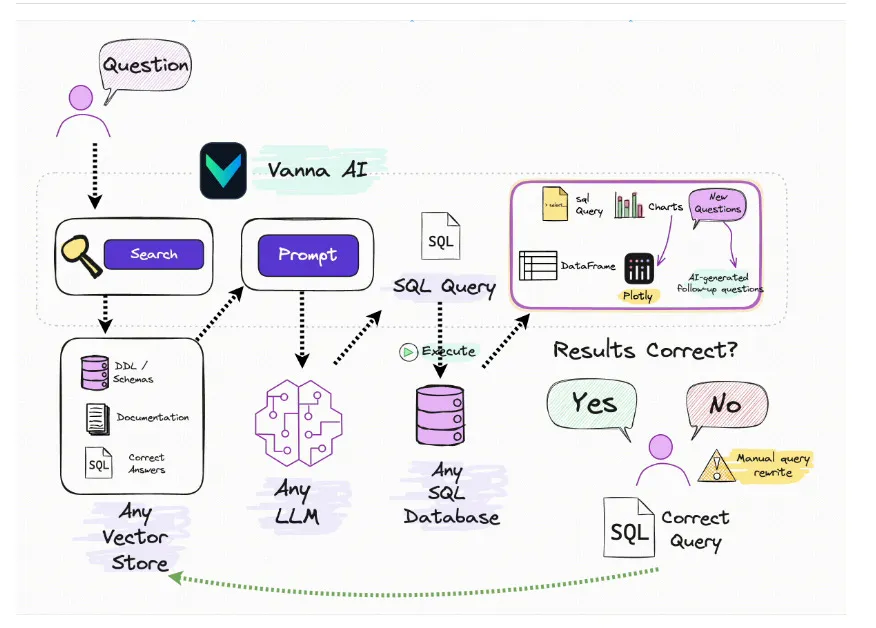
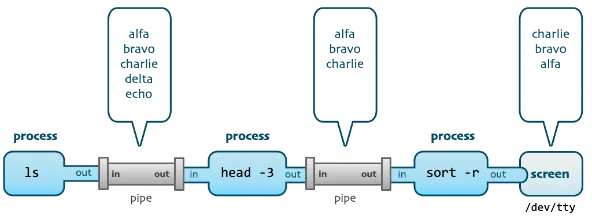

# SQL 优化生成

## 度量

Text2SQL  榜单：[Spider](https://yale-lily.github.io/spider)

## 示例

### RAG2SQL：Vanna

[Vanna](https://github.com/vanna-ai/vanna)  is an MIT-licensed open-source Python RAG (Retrieval-Augmented Generation)
framework for SQL generation and related functionality.



[Vanna: The Supercharged Text-to-SQL Tool All Data Scientists Were Looking For](https://blog.dailydoseofds.com/p/vanna-the-trainable-text-to-sql-agent)


#### Function RAG

**Function RAG（检索增强生成）** 是 Vanna.ai 引入的一项创新功能，旨在改进 SQL 生成。以下是详细说明：

#### 什么是 Function RAG？

Function RAG 将传统的“问题-SQL”对转换为可重用的模板或函数，这些模板由大语言模型（LLM）调用以生成 SQL 查询和相关的后处理代码（如图表代码）。LLM
的作用是选择合适的 SQL 模板并填充必要的参数，从而实现更一致且更快速的 SQL 生成。

#### Function RAG 的主要特点：

1. **基于模板的 SQL 生成**：通过使用从训练对创建的模板，Function RAG 确保生成的 SQL 既准确又相关。
2. **增强的安全性**：这种方法减少了提示注入和提示转义等漏洞，使 SQL 生成过程更加安全。
3. **用户特定查询**：用户可以在查询中包含特定信息，如用户 ID，且不会有数据被覆盖的风险，从而安全地实现个性化查询。
4. **集成图表代码生成**：Function RAG 可以在一次请求中生成 SQL 及相应的可视化代码（如 Plotly 代码）。
5. **多语言支持**：通过 GraphQL API 访问，Function RAG 可以在各种编程语言中使用，不仅限于 Python，便于集成到不同的后端，如
   Ruby on Rails、.NET 等。

#### 使用示例：

- **查找函数**：使用 `vn.get_function(question=...)` 查找并调用适当的函数，由 LLM 填充参数。
- **限定到特定用户**：使用 `vn.get_function(question=..., additional_data={"user_id": ...})`
  确保查询限定到特定用户，通过确定性地设置 `user_id` 参数。
- **创建新函数**：可以手动使用 `vn.create_function(question=..., sql=..., plotly_code=...)` 创建函数，或者通过支持自动从问题中提取参数的
  Web 应用创建函数。

#### 何时使用 Function RAG：

Function RAG 适用于终端用户频繁提出类似问题的场景。它允许进行受控和批准的分析，确保呈现的数据可靠且正确。此功能特别适合内部业务用户或
SaaS 应用程序。然而，对于更多新颖和多样的分析，传统的 SQL 生成功能可能更合适。


### Text to SPL

[日志易 Text to SPL 探索](https://mp.weixin.qq.com/s/maEWbNBUhNaO0_WwfmSEPw)



```jflex
<data-source> | <spl-expr> ... | <spl-expr> ...
```

[SLS 查询新范式：使用 SPL 对日志进行交互式探索](https://www.cnblogs.com/alisystemsoftware/p/18151174)

> SPL 即 SLS Processing Language，是 SLS 对日志查询、流式消费、数据加工、Logtail 采集、以及数据 Ingestion
> 等需要数据处理的场景，提供的统一的数据处理语法，这种统一性使得 SPL 可以在整个日志处理的生命周期内，实现 "Write Once，Run
> Anywhere" 的效果。


`<spl-expr>` 是 SPL 指令，支持正则取值、字段分裂、字段投影、数值计算等多种操作，具体参考 SPL 指令介绍。

示例：

```
Status:200 | extend urlParam=split_part(Uri, '/', 3)
Status:200 | extend timeRange = cast(BeginTime as bigint) - cast(EndTime as bigint
```

示例 2：

```
Status:200 
| where UserAgent like '%Chrome%'
| extend timeRange = cast(BeginTime as bigint) - cast(EndTime as bigint)
| where timeRange > 86400
```

