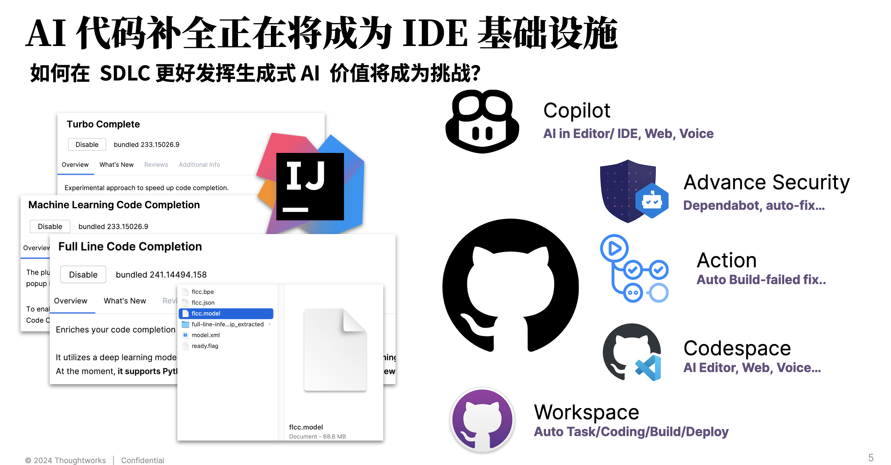
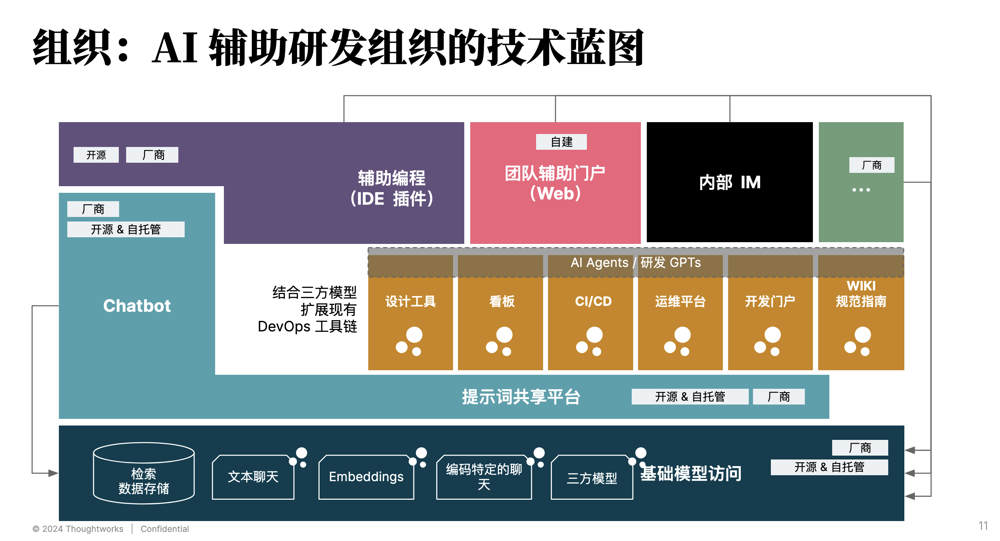
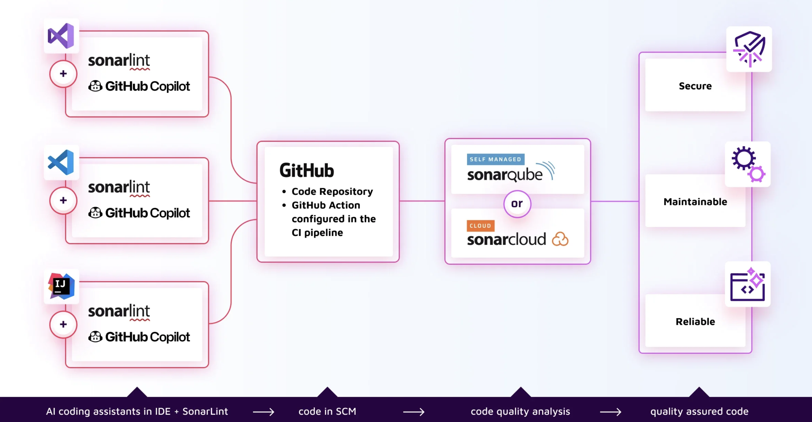
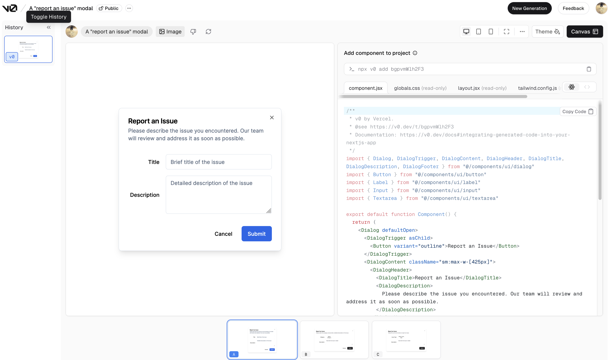

# AI 辅助软件工程：AI4SE 的 2024 趋势

> AI4SE（Artificial Intelligence for Software Engineering）是指人工智能技术应用于软件工程领域，旨在通过利 用AI 算法和工具来改进软件开发、
> 维护、测试和管理等各个环节的效率和效果。AI4SE的核心目标是通过自动化和智能化技术，降低软件开发的复杂性，提高软件的质量，并加速软件工程过程。

从 2024 年的视角回顾，与 2023 年相比，AI 在软件工程中的应用已经变得更加广泛和深入。这一趋势体现在AI编程工具的进化上，主要体现在以下几个方面：

1. 全面探索：从辅助开发人员到全生命周期
2. 演进路径：个体、团队、组织
3. 形态变化：从本地 AI IDE 到领域特定的智能代码生成

站在全球来看，在不同的国家、区域人们的关注点是不一样的，比如在中国，人们更关注于如何提高软件工程师的工作效率，而在其它一些区域，人们更关注于如何
提高软件工程的质量、如何辅助进行遗留系统的迁移。 除了各自所处的数字化阶段、水平不同，还存在一些技术人才数量、质量、分布等方面的差异。

## 全面探索：从辅助开发人员到全生命周期

AI 技术已经从简单的辅助开发人员发展到涵盖软件开发的整个生命周期。在这一过程中，AI 工具的应用范围不断扩展，从需求分析到运维管理，每个阶段都得到了显著提升。

### 单工具 Copilot

下图是，Thoughtworks 在 2023 年初对 AI 辅助软件工程的流程分析，即在软件开发的不同阶段，AI 可以提供哪些辅助功能：


从 2022 年 GitHub Copilot 的发布，我们可以看到越来越多的 AI 工具开始涉足到软件开发的不同阶段。

- 需求阶段的 Jira/[Atlassian Intelligence](https://www.atlassian.com/platform/artificial-intelligence)
- 原型设计的 [Vercel V0](https://v0.dev/)
- 编码阶段的 GitHub Copilot
- 运维阶段的 [Dynatrace Davis AI](https://www.dynatrace.com/platform/artificial-intelligence/)
- ……

就 2023 年的结论而言，基于人工智能的工具与基础大语言模型可以增强软件开发在设计、 需求、测试、发布和运维等各个环节中的能力，提高质量和效率。
但是，这些工具往往是破碎、割裂的，还可能并不适合我们现有的研发流程。

### AI 原生的研发工具

在市场上，我们也可以看到市面上的主流研发工具，如 JetBrains、GitHub（网站）等，都在逐渐加入 AI 功能，使得 AI 功能逐渐融入到我们的日常工作中。



在 IntelliJ IDEA 中，我们可以看到 AI 功能的加入，如：

- 原生的向量化模型
- 基于语义化搜索（SearchEverywhere）
- 结合补全统计的机器学习补全插件：Machine Learning Code Completion
- 适用于单个代码行的 Full Line Code Completion
- 等等

而除了 GitHub Copilot 工具本身，其也开放了其插件能力，使得我们可以定义自己的 AI
智能体，以适应我们自己的工作流程：[Chat extensions](https://code.visualstudio.com/api/extension-guides/chat)

### 多阶段协同

在 2024 年，我们可以更多的变化，诸如：

- 在智能运维领域，AI 可以结合判别性 AI 分析日志，生成式 AI 分析原因，再结合智能体跟据运行错误，自动修代码复问题等
- 在测试领域，AI 除了辅助进行测试用例的生成，还可以生成对应的单元测试代码，甚至是自动化测试代码。
- 在 UI 设计领域，AI 可以直接生成对应的代码，基于提示词来修改 UI，所生成的是最终的 UI 代码，而不是设计稿。
- ……

如下是 Dynatrace 的 Davis AI 示例：


Dynatrace 的 Hypermodal AI（超模态人工智能），是一种将多种类型的人工智能整合在一起，以增强可观察性和安全解决方案的高级方法。
这个概念结合了三种不同的AI模式：

1. **预测AI**：使用历史数据和观察到的模式来预测未来的行为和需求。这对于在问题发生之前预见并防止潜在问题至关重要。
2. **因果AI**：专注于实时分析富有上下文的数据，以确定问题的根本原因并自动化风险缓解。这种类型的AI通过理解系统内的依赖关系和交互，提供精确的答案。
3. **生成AI**：利用高级算法来创建针对特定问题的建议和解决方案。通过提供上下文相关的建议和使用自然语言处理自动化任务，这种AI增强了用户互动。

通过融合这些AI功能，超模态AI为管理复杂的软件环境提供了更全面和有效的解决方案。Dynatrace 的 Davis AI 平台通过整合预测 AI、因果
AI 和生成 AI，
提供实时洞察、自动化和增强的数字服务安全性。

诸如此类的变化，使得 AI 所能辅助的范围更加广泛，从而使得 AI 在软件工程中的应用更加全面。

## 演进路径：个体、团队、组织

从企业采用 AI 的路径来看，我们会发现：越来越多的组织开始探索在组织层面使用 AI 辅助整体软件研发。因而，AI
辅助研发组织的技术蓝图便也逐渐清晰起来：



从形态上可以分为：带扩展能力的 IDE 插件、团队 AI 助手、 结合 AI 的内部 IM，以及作为基础能力的 Chatbot。

### 个体辅助 IDE 插件示例：AutoDev

AI 编程工具应该怎么设计才能提效？在当前来说，国内的环境下，由于我们的目标是**实现可见的效率提升**，即要通过可度量的指标。因而，可以看到一些明显
的变化：

1. 代码补全与生成是最容易度量的指标，并且市面上也以此类为主。
2. 在不同环节，从时间角度来计算，如代码审查、代码测试等。
3. 结合代码的问答，以减少工具切换、复制粘贴，提高效率。

如下是我们开源的 IDE 插件 AutoDev 的能力全景图：


由于过去的 AI 编程工具主要面向的是个体开发者，而随着探索进入一些深入区，以及实践的不断推进。所以，在结合组织能力的情况下，我们可以看到：

- 多样的 AI 工具正在融入自己的开发流程中
- AI 工具开始融入内部的一系列规范
- 不断结合内部知识库，提升内容生成的质量
- 开始构建自己的场景化能力

故而，我们将其总结为，从个体到团队，再到组织，并开始思考如何扩大 AI 的应用范围。

### 团队 AI 助手示例：Haiven

在设计团队 AI 助手时，我们需要考虑到团队的拓扑结构，以及团队的工作流程。如下图所示：


在一个组织中，必然会有大量的不同类型的团队，每个团队受限于业务盈利模式等因素，其采用的技术、工作流程等都会有所不同。诸如于，核心的业务部门可以
享受自己特有的开发流程，而其它非核心部门则会采用一些标准化的流程。

考虑到盈利水平高的部门，通常是大型团队，他们不仅可能有自己的 AI IDE 插件，还会有自己的 AI 团队。因此，我们也建议设计一个可以让不同团队共享知识的
AI 团队助手。

诸如于 Haiven™ 团队助手：

> [Haiven™ 团队助手](https://github.com/tw-haiven/haiven) 是由 Thoughtworks 开发的一款 AI 驱动工具，旨在增强软件开发流程。它与现有的
> AI 编码助手集成，并提供可插拔的知识包，帮助团队完成开发任务、加速反馈循环，并推动创新。Haiven 支持多种云和身份提供商，便于采用并集成到现有工作流程中。
> 它支持研究、用户旅程分析、 架构开发和团队知识编码，从而提升生产力、质量和团队能力，同时保持对 AI 环境的控制。

- **提高软件开发的生产力和质量**。可复用提示词（prompt）可以将最佳实践和即时知识融入团队的工作流程，以减少浪费，提升开发者满意度，并保持软件质量始终如一。
- **动态增强团队成员能力**。Haiven 增强了团队的自然人类创造力，使他们能够轻松研究用户需求，探索创新功能并交付卓越的用户体验。
- **易于采用**。支持多云和身份提供商，以及可根据团队工作流程定制的可插拔知识包，Haiven 极易被采用和集成。
- **理解今天的 AI 的潜力**。AI 市场是动态且迅速发展的，许多工具并未专门针对软件开发任务设计，或者只关注有限的功能范围。Haiven
  提供了一个简单的沙盒，用于今日试验新功能。

通过基础的 AI 赋能，让不同团队在有能力的情况下，可以根据自己的需求，定制自己的 AI 助手。

### 组织级 IM/Chatbot 示例

回到整体组织层面，我们也会看到内部的 IM 工具也在融合 AI 功能，以提升协作体验。诸如于：

- 寻找负责人/专家：通过 AI 助手，可以快速找到组织内的专家，以解决问题。
- 运维 Chatbot，辅助分析部署失败问题，可以自动化运维任务，如自动化部署、自动化监控等。
- CI/CD 问题分析：通过 AI 助手，在尝试修复问题时，还可以告知问题的可能根因。
- AI 会议创建与管理。通过 AI 助手，可以自动创建会议，自动邀请参会人员，自动记录会议内容，自动提醒会议时间等。

如下是 Teams Copilot 的示例：


在另外一方面，我们也会有大量的其它 Chatbot 在不同的研发团队中使用，诸如于辅助平台的使用、文档查找等等。

## 形态变化：从本地 AI IDE 到领域特定的智能代码生成

与通用性的 AI 辅助相比，领域特定的 AI 辅助效果更好，因为它更了解领域的特点，更容易生成符合领域规范的代码。从智能代码生成的角度来看，由于过去包含
大量的语料知识，生成的代码质量更高，更符合领域规范。

### IDE 即 AI 辅助研发中心

在前面，我们已经看到了 AI 辅助研发中心的概念，即在一个组织中，AI 辅助研发中心可以为不同团队提供 AI 能力，以提升整体的研发效率。

还需要注意的是，AI 在快速生成大量代码的同时，也会带来一些问题，如代码质量、安全性等。我们需要考虑如何在 AI
生成代码的同时，保证代码的质量。如下图
所示：



我们需要考虑[构建类似于 SonarLint 的体系化质量检查](https://www.sonarsource.com/learn/ai-assisted-software-development/)
工具，以保证 AI 生成的代码质量。

### AI 增强的低代码平台

诸如低代码应用程序平台 Appian
的[分析文章](https://appian.com/blog/acp/process-automation/generative-ai-low-code-things-to-know) ，生成式 AI
与低代码平台结合，可以在多个方面实现增强的生产力和创新：

1. **文本生成与聊天机器人：** 结合生成式 AI 和低代码平台，能够快速部署聊天机器人，处理基本的客服请求或生成待人审阅的电子邮件草稿，从而简化沟通流程。
2. **从 PDF 构建界面：** 生成式 AI 能够解析 PDF 设计并将其转换为功能性界面或表单。结合低代码平台，确保设计到代码的准确转换，无需额外校对。
3. **工作流程自动生成：** 通过生成式 AI 增强的低代码平台，可以快速生成复杂的工作流程，包括视觉图表和可执行代码。这对于例如账单管理等任务至关重要，用户反馈后能快速进行迭代改进。
4. **自助式分析：** 利用自然语言处理的 AI 驱动平台，团队能够快速从数据源生成报告和洞察。AI
   与低代码的结合，使得能够灵活调整流程和操作，提升业务效率和决策能力。

除了上述的经典场景之后，我们也可以看到多模态 AI 代码的生成，诸如于 Google
的 [ScreenAI](https://research.google/blog/screenai-a-visual-language-model-for-ui-and-visually-situated-language-understanding/)。


它可以将图像和文本结合起来，生成对应的 DSL，进而转换成不同的代码。

```markdown
You only speak JSON. Do not write text that isn’t JSON.
You are given the following mobile screenshot, described in words. Can you generate 5 questions regarding the content of
the screenshot as well as the corresponding short answers to them?

The answer should be as short as possible, containing only the necessary information. Your answer should be structured
as follows:
questions: [
{{question: the question,
answer: the answer
}},
...
]

{THE SCREEN SCHEMA}
```

当然了，为构建这样的语料，你还需要生成大量的页面与低代码数据。

### 从云 IDE 到智能云开发环境

在云 ☁️ 时代，大型组织构建了大量的云 IDE 和云基础设施，以尝试卖出更多的云服务以及解决最后一公里的部署问题。尽管，受限于云
IDE 能力、网络与计算能力，
云 IDE采用并不高，但是随着 AI 的发展，我们可以看到更多的智能云开发环境的出现。

虽然..但是..，我们非常看好诸如 v0.dev 这一类针对于领域特定的开发工具。



它可以：

- 高效 UI 生成：通过输入提示词快速创建前端组件和页面。
- 一键定制化组件：少量的提示词即可创建优雅复杂的组件，一键导出并应用于项目。
- 快速原型设计：提供即用生产代码，适用于新旧项目，项目较大时需整理代码结构。
- 图生成代码：通过图形化界面生成代码，适用于新手，不熟悉代码的人员。

它可以快速帮助我们构建出一个原型，然后再进行。再结合其它 AI 工具，如代码审查、代码测试等，可以大大提高我们的开发效率。

还有诸如 Google [Project IDX](https://developers.google.com/idx) 这一类 AI 辅助型工作区。IDX 支持众多框架、语言和服务，
还与 Google 产品集成，可简化您的开发工作流程，让您可以快速、轻松、高效地跨平台构建和发布应用。


尽管 IDX 还非常早期，但是我们可以看到，未来的云 IDE 将会更加智能化，更加适应我们的工作流程。

在国内，我们也可以看到 [Babel Cloud](https://babelcloud.ai/)、MarsCode 等一系列云 IDE 工具，也在不断的发展中。

## 其它

AI 在软件工程中的应用已经从辅助开发人员扩展到整个开发生命周期，逐步演进为团队和组织层面的协作工具，并在工具形态上实现了从本地
AI IDE 到领域特定智能代码生成的转变。这些变化不仅提高了开发效率和质量，还推动了整个软件工程领域的发展。

1. **全面探索**：AI 从辅助开发人员扩展到覆盖软件开发的整个生命周期，从需求分析到运维管理，每个阶段都显著提升了效率和质量。
2. **演进路径**：AI 工具从个体使用扩展到团队和组织层面。个体使用的 AI 工具如 AutoDev，团队助手如 Haiven，以及组织层面的 AI
   集成到内部 IM 和 Chatbot 系统中，全面增强了协作和效率。
3. **形态变化**：从本地 AI IDE 发展到领域特定的智能代码生成工具。智能云开发环境如 Google 的 Project IDX
   等工具，使得未来的开发流程更加智能化和高效。

这些变化不仅提高了开发效率和质量，还推动了整个软件工程领域的发展。

相关材料：

-
材料见：[大模型时代， AI 辅助编程工具的技术演进](https://github.com/unit-mesh/conf/blob/master/%E5%A4%A7%E6%A8%A1%E5%9E%8B%E6%97%B6%E4%BB%A3%EF%BC%8C%20AI%20%E8%BE%85%E5%8A%A9%E7%BC%96%E7%A8%8B%E5%B7%A5%E5%85%B7%E7%9A%84%E6%8A%80%E6%9C%AF%E6%BC%94%E8%BF%9B.pdf)

- B 站视频：[大模型时代，AI辅助工具的技术演进-黄峰达](https://www.bilibili.com/video/BV1HJ4m1p7Dp/)
