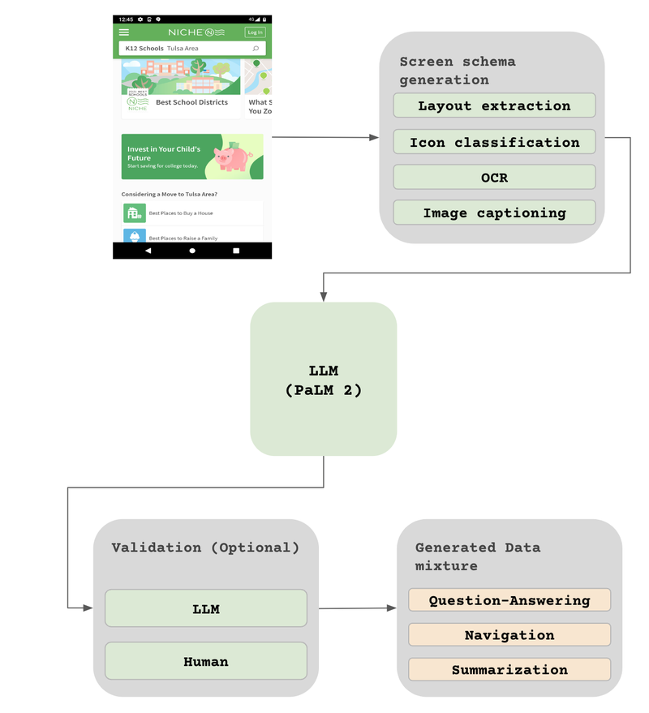
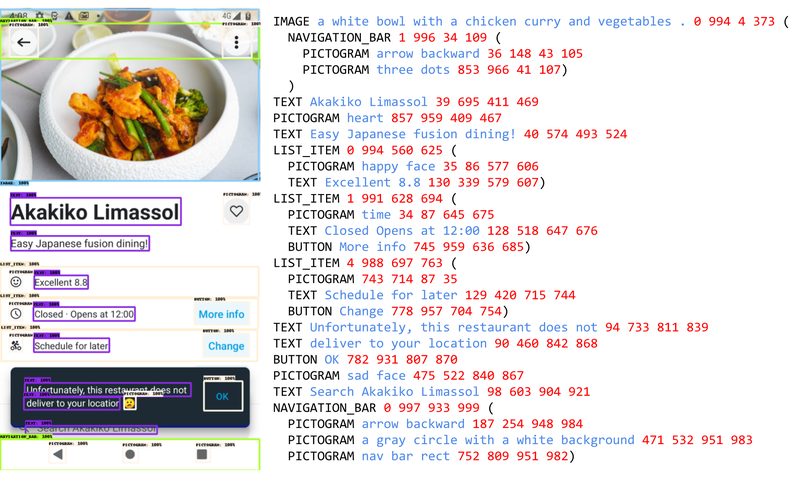

# AI4SE 的 2024 趋势

从 2024 年的视角回顾，与 2023 年相比，AI 在软件工程中的应用已经变得更加广泛和深入。这一趋势体现在AI编程工具的进化上，主要体现在以下几个方面：

1. 全面探索：从辅助开发人员到全生命周期
2. 演进路径：个体、团队、组织。
3. 形态变化：从 AI IDE 到智能驱动的开发环境

站在全球来看，在不同的国家、区域人们的关注点是不一样的，比如在中国，人们更关注于如何提高软件工程师的工作效率，而在其它一些区域，人们更关注于如何
提高软件工程的质量、如何辅助进行遗留系统的迁移。 除了各自所处的数字化阶段、水平不同，还存在一些技术人才数量、质量、分布等方面的差异。

## 全面探索：从辅助开发人员到全生命周期

AI 技术已经从简单的辅助开发人员发展到涵盖软件开发的整个生命周期。在这一过程中，AI 工具的应用范围不断扩展，从需求分析到运维管理，每个阶段都得到了显著提升。

### 单工具 Copilot

下图是，Thoughtworks 在 2023 年初对 AI 辅助软件工程的流程分析，即在软件开发的不同阶段，AI 可以提供哪些辅助功能：


从 2022 年 GitHub Copilot 的发布，我们可以看到越来越多的 AI 工具开始涉足到软件开发的不同阶段。

- 需求阶段的 Jira/[Atlassian Intelligence](https://www.atlassian.com/platform/artificial-intelligence)
- 原型设计的 [Vercel V0](https://v0.dev/)
- 编码阶段的 GitHub Copilot
- 运维阶段的 [Dynatrace Davis AI](https://www.dynatrace.com/platform/artificial-intelligence/)
- ……

就 2023 年的结论而言，基于人工智能的工具与基础大语言模型可以增强软件开发在设计、 需求、测试、发布和运维等各个环节中的能力，提高质量和效率。
但是，这些工具往往是破碎、割裂的，还可能并不适合我们现有的研发流程。

### AI 原生的研发工具

在市场上，我们也可以看到市面上的主流研发工具，如 JetBrains、GitHub（网站）等，都在逐渐加入 AI 功能，使得 AI 功能逐渐融入到我们的日常工作中。


在 IntelliJ IDEA 中，我们可以看到 AI 功能的加入，如：

- 原生的向量化模型
- 基于语义化搜索（SearchEverywhere）
- 结合补全统计的机器学习补全插件：Machine Learning Code Completion
- 适用于单个代码行的 Full Line Code Completion
- 等等

而除了 GitHub Copilot 工具本身，其也开放了其插件能力，使得我们可以定义自己的 AI
智能体，以适应我们自己的工作流程：[Chat extensions](https://code.visualstudio.com/api/extension-guides/chat)

### 多阶段协同

在 2024 年，我们可以更多的变化，诸如：

- 在智能运维领域，AI 可以结合判别性 AI 分析日志，生成式 AI 分析原因，再结合智能体跟据运行错误，自动修代码复问题等
- 在测试领域，AI 除了辅助进行测试用例的生成，还可以生成对应的单元测试代码，甚至是自动化测试代码。
- 在 UI 设计领域，AI 可以直接生成对应的代码，基于提示词来修改 UI，所生成的是最终的 UI 代码，而不是设计稿。
- ……

如下是 Dynatrace 的 Davis AI 示例：


Dynatrace 的 Hypermodal AI（超模态人工智能），是一种将多种类型的人工智能整合在一起，以增强可观察性和安全解决方案的高级方法。
这个概念结合了三种不同的AI模式：

1. **预测AI**：使用历史数据和观察到的模式来预测未来的行为和需求。这对于在问题发生之前预见并防止潜在问题至关重要。
2. **因果AI**：专注于实时分析富有上下文的数据，以确定问题的根本原因并自动化风险缓解。这种类型的AI通过理解系统内的依赖关系和交互，提供精确的答案。
3. **生成AI**：利用高级算法来创建针对特定问题的建议和解决方案。通过提供上下文相关的建议和使用自然语言处理自动化任务，这种AI增强了用户互动。

通过融合这些AI功能，超模态AI为管理复杂的软件环境提供了更全面和有效的解决方案。Dynatrace 的 Davis AI 平台通过整合预测 AI、因果
AI 和生成 AI，
提供实时洞察、自动化和增强的数字服务安全性。

诸如此类的变化，使得 AI 所能辅助的范围更加广泛，从而使得 AI 在软件工程中的应用更加全面。

## 演进路径：个体、团队、组织

从企业采用 AI 的路径来看，我们会发现：越来越多的组织开始探索在组织层面使用 AI 辅助整体软件研发。因而，AI 辅助研发组织的技术蓝图便也逐渐清晰起来：


从形态上可以分为：带扩展能力的 IDE 插件、团队 AI 助手、 结合 AI 的内部 IM，以及作为基础能力的 Chatbot。

### 个体辅助 IDE 插件示例：AutoDev

AI 编程工具应该怎么设计才能提效？在当前来说，国内的环境下，由于我们的目标是**实现可见的效率提升**，即要通过可度量的指标。因而，可以看到一些明显
的变化：

1. 代码补全与生成是最容易度量的指标，并且市面上也以此类为主。
2. 在不同环节，从时间角度来计算，如代码审查、代码测试等。
3. 结合代码的问答，以减少工具切换、复制粘贴，提高效率。

如下是我们开源的 IDE 插件 AutoDev 的能力全景图：


由于过去的 AI 编程工具主要面向的是个体开发者，而随着探索进入一些深入区，以及实践的不断推进。所以，在结合组织能力的情况下，我们可以看到：

- 多样的 AI 工具正在融入自己的开发流程中
- AI 工具开始融入内部的一系列规范
- 不断结合内部知识库，提升内容生成的质量
- 开始构建自己的场景化能力

故而，我们将其总结为，从个体到团队，再到组织，并开始思考如何扩大 AI 的应用范围。

### 团队 AI 助手示例：Haiven


[Haiven™ 团队助手](https://github.com/tw-haiven/haiven) 是由 Thoughtworks 开发的一款 AI 驱动工具，旨在增强软件开发流程。它与现有的
AI 编码助手集成，并提供可插拔的知识包，帮助团队完成开发任务、加速反馈循环，并推动创新。Haiven 支持多种云和身份提供商，便于采用并集成到现有工作流程中。
它支持研究、用户旅程分析、 架构开发和团队知识编码，从而提升生产力、质量和团队能力，同时保持对 AI 环境的控制。

- **提高软件开发的生产力和质量**。可复用提示词（prompt）可以将最佳实践和即时知识融入团队的工作流程，以减少浪费，提升开发者满意度，并保持软件质量始终如一。
- **动态增强团队成员能力**。Haiven 增强了团队的自然人类创造力，使他们能够轻松研究用户需求，探索创新功能并交付卓越的用户体验。
- **易于采用**。支持多云和身份提供商，以及可根据团队工作流程定制的可插拔知识包，Haiven 极易被采用和集成。
- **理解今天的 AI 的潜力**。AI 市场是动态且迅速发展的，许多工具并未专门针对软件开发任务设计，或者只关注有限的功能范围。Haiven
  提供了一个简单的沙盒，用于今日试验新功能。

### 内部 IM / Chatbot 示例

对于内部 IM 而言，


在另外一方面，我们也会有大量的 Chatbot 在不同的研发团队中使用。

## 形态变化：从 AI IDE 到智能驱动的开发环境

### 端、云端 AI IDE 插件

### AI 增强的低代码平台

[ScreenAI](https://research.google/blog/screenai-a-visual-language-model-for-ui-and-visually-situated-language-understanding/)



```markdown
You only speak JSON. Do not write text that isn’t JSON.
You are given the following mobile screenshot, described in words. Can you generate 5 questions regarding the content of the screenshot as well as the corresponding short answers to them?

The answer should be as short as possible, containing only the necessary information. Your answer should be structured as follows:
questions: [
{{question: the question,
answer: the answer
}},
...
]

{THE SCREEN SCHEMA}
```

当然了，为构建这样的语料，你还需要生成大量的数据



### 智能开发环境

在云 ☁️ 时代，人们构建云

诸如于 v0.dev、MarsCode

## 其它

参考材料：

-

材料见：[大模型时代， AI 辅助编程工具的技术演进](https://github.com/unit-mesh/conf/blob/master/%E5%A4%A7%E6%A8%A1%E5%9E%8B%E6%97%B6%E4%BB%A3%EF%BC%8C%20AI%20%E8%BE%85%E5%8A%A9%E7%BC%96%E7%A8%8B%E5%B7%A5%E5%85%B7%E7%9A%84%E6%8A%80%E6%9C%AF%E6%BC%94%E8%BF%9B.pdf)

- B 站视频：[大模型时代，AI辅助工具的技术演进-黄峰达](https://www.bilibili.com/video/BV1HJ4m1p7Dp/)
