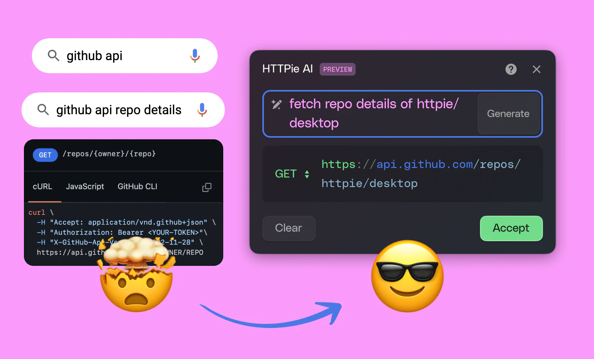

# AI 辅助软件工程：AI  生成 API 测试

## 示例

### 示例：HTTPie AI

[HTTPie AI 助手](https://httpie.io/blog/ai) 利用先进的自然语言处理技术，使用户能够通过简单的自然语言描述来生成和管理 API
请求，而不需要手动编写请求代码。HTTPie AI 可以理解用户的意图，将其转换为相应的 HTTP 请求，从而简化与 API 的交互过程，提高开发者的工作效率。

### Checksum: 模拟行为生成测试

[Why We Built A System of AI Agents to Automate E2E Testing](https://checksum.ai/blog/the-engineering-of-an-llm-agent-system)

客户将 JavaScript SDK 集成至他们的 HTML 中，Checksum 将收集匿名使用模式数据。接着，通过这些数据，训练出的模型能够高效执行以下三项任务：

1. 检测测试流程，包括标准路径与边缘情况，以吻合真实的使用模式。
2. 在实时环境中执行测试流程，并生成 Playwright 或 Cypress 代码。
3. 在测试运行过程中维护这些测试，确保软件更新时，测试套件也能同步更新。

LLM 智能体是连接各项功能并能够执行代码的 LLM，已相对成熟。但在 Checksum，其洞察力更进一步。公司并未单独训练一个 LLM
模型以生成完整测试。 其解决方案是将多个模型集成，形成一个系统，旨在将线上执行流程转换为端到端的测试代码。

整个系统由主 Checksum LLM 协调，该模型在系统中扮演着至关重要的角色。

代码：https://github.com/checksum-ai/checksum-ai-runtime

相关文章：

* [Pix2Struct](https://arxiv.org/abs/2210.03347)
* [OS-Copilot: Towards Generalist Computer Agents with Self-Improvement](https://arxiv.org/abs/2402.07456)
* [CoVA: Context-aware Visual Attention for Webpage Information Extraction](https://arxiv.org/abs/2110.12320)

### Applitools

https://applitools.com/why-applitools/

审查由 Visual AI 识别出的任何变化

- 设置动态内容的匹配级别。Applitools 智能地识别哪些错误是关键性的，哪些是可以接受的，通过高级匹配级别来实现。用户还可以通过选择突出显示或忽略 UI 的某些区域，进一步微调视觉 AI 的目标定位。
- 创建测试以匹配多个基线。只需点击一个按钮，即可构建能够匹配多个基线的测试——这对于 A/B 测试和本地化语言来说非常理想。
- 跟踪错误并与团队评论。在软件开发生命周期中，与其他人协作，直接在 UI 上进行评论，并使用您喜欢的错误跟踪工具集成来报告错误。
- 通过分组自动化维护。Applitools 自动将不同应用和环境中的相似错误进行分组，以便在更大范围内实现更轻松、更快速的维护，并通过根本原因分析准确指出问题所在。

#### Visual AI 测试的力量

Visual AI 测试提供了一种革命性的方法，用以克服传统测试中的挑战。它通过捕获屏幕截图，并利用 AI 将这些快照与基准“黄金图像”进行对比，确保以下优势：

1. 减少测试开发与维护时间：自动化UI比较大幅降低了编写和维护测试所需的时间。
2. 完整的 UI 覆盖：屏幕截图确保UI的每个方面都得到测试，消除了盲点。
3. 提高运营效率：更快的反馈循环有助于快速识别和解决问题，从而加速产品发布。

其他辅助 Visual AI 测试的策略包括：

1. 自我修复：通过自动调整定位器的变化，纠正不稳定的测试，大幅提高测试稳定性。
2. 懒加载：有助于确保整个页面内容被加载。
3. 并行测试执行：允许同时执行多个测试，显著加快测试过程。

