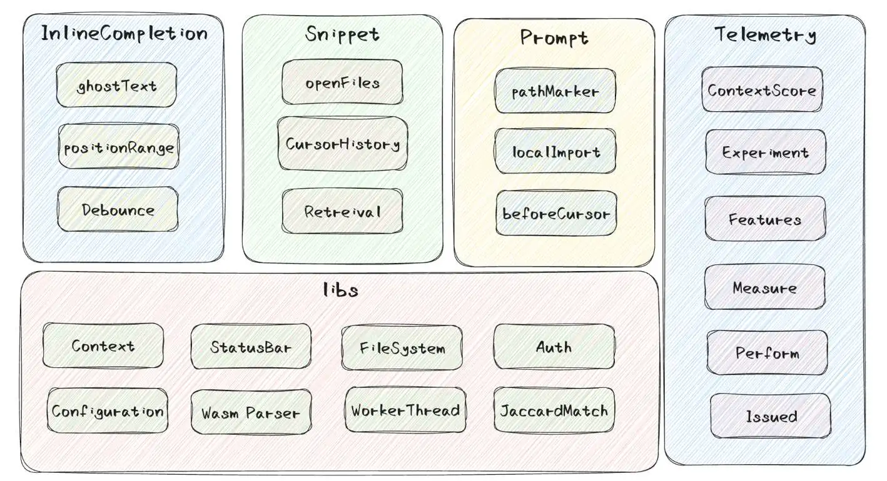
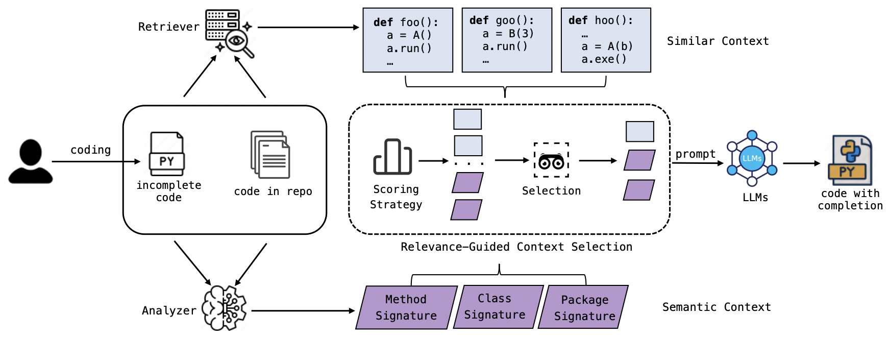

# AI 辅助软件工程：代码补全

## 示例

### 补全插件示例：GitHub Copilot

- 《[花了大半个月，我终于逆向分析了Github Copilot](https://github.com/mengjian-github/copilot-analysis)》
- 《[再次揭秘Copilot：sourcemap逆向分析](https://github.com/mengjian-github/copilot-analysis-new)》



- 对于编辑器输入的边界判断，包括太少、太多、取消等等很多场景齐全的考虑
- 缓存思想，利用多级缓存策略保护后台，模型运算本身就是一件昂贵的事情
- prompt的设计，不仅仅包含了上下文代码，在文件解析、编辑器打开的相关代码上还做了很多
- 利用简单的Jaccard算法计算分词后的文本相似度，能够快速决策出当前上下文相关的snippet
- 实验特性，在Copilot中，大量的参数、优先级、设置字段都是通过实验来控制的，有一套完整的监控上报体系，帮助Copilot去调整这些参数，以达到更好的效果

### 补全插件示例：Cody

结合《[The lifecycle of a code AI completion](https://sourcegraph.com/blog/the-lifecycle-of-a-code-ai-completion)》

每个Cody补全都经过以下四个步骤：

- 规划 - 分析代码上下文以确定生成补全的最佳方法，例如使用单行补全还是多行补全。
- 检索 - 从代码库中查找相关代码示例，为LLM提供最合适的上下文。
- 生成 - 使用LLM根据提供的提示和上下文生成代码补全。
- 后处理 - 对AI生成的原始补全进行细化和过滤，以提供最相关的建议。

Cody的目标是提供与开发者工作流程无缝集成的高质量补全。


详细步骤如下：

1. **规划阶段:**
    - **上下文准备:** 根据上下文确定生成自动补全建议的最佳方法。这涉及使用启发式和规则将请求分类为单行或多行补全。
    - **语法触发器:** 使用诸如Tree-sitter之类的工具分析代码结构，确定精确的语法线索，影响补全行为。
    - **建议小部件（Suggestion widget）交互:** 利用与建议小部件的交互（例如在VS Code等IDE中）来增强补全建议的相关性和可用性。
2. **检索阶段:**
    - **上下文检索:** 从编辑器上下文中收集相关的代码示例，例如最近查看的文件或打开的选项卡。
    - **优化:** 使用滑动窗口 Jaccard 相似性搜索等技术，根据与当前光标位置相关的相关性检索和排名代码片段。
    - **上下文嵌入:** 尝试使用嵌入索引等技术来提高上下文理解和补全建议的相关性。
3. **生成阶段:**
    - **模型利用:** 使用 Claude Instant 等大型语言模型（LLM）根据提供的提示生成代码补全。
    - **改进:** 解决 FIM "填充中间" 支持、减少延迟和质量调整等挑战，通过优化提示结构和理解模型响应动态。
    - **降低延迟:** 实施 Token 限制、stop-words、流式响应和高效的 TCP 连接处理等策略，以减少端到端的延迟。
4. **后处理阶段:**
    - **质量保证:** 应用后处理技术来优化生成的补全。
    - **内容改进:** 避免重复内容，适当截断多行补全，并使用语法分析和概率评分评估补全的相关性。
    - **过滤:** 实施过滤器来移除明显低质量的补全建议，同时确保在显示足够相关建议和不过度展示之间取得平衡。

每个阶段在提升 Cody 代码补全功能的整体质量、速度和用户体验方面都发挥着关键作用，旨在利用先进的人工智能能力，同时优化代码编辑环境中的实际使用场景。

### 补全插件示例：Continue

文章：[How can you improve the code suggestions you get from LLMs?](https://blog.continue.dev/improve-code-suggestions/)

在使用 LLM（大型语言模型）工具时，有几点需要注意，以确保获得高质量的代码建议并避免错误。Josh
Collinsworth 在他的文章中提出了一些值得关注的问题和改进方法，以下是总结和一些建议：

1. **提供明确而全面的指示（prompt）**
    - **优点**：
        - 如果你很了解自己在做什么，这个方法很容易操作。
        - 可以根据具体情况进行定制。
    - **缺点**：
        - 指示可能需要非常精确，以至于直接写代码更容易。
        - 过程缓慢且繁琐，每个人每次都要重复进行。

2. **添加系统消息，包含应始终遵循的指示**
    - **优点**：
        - 可以设置一次，然后忘记（类似于环境变量）。
        - 对许多事情效果很好（例如操作系统版本）。
    - **缺点**：
        - 很难事先预测所有可能的指示。
        - 由于上下文长度限制，系统消息中的信息量有限。

3. **自动过滤明显错误的建议，并请求新建议**
    - **优点**：
        - 可以确保代码不违反许可证，使用特定库等。
        - 过滤器捕获建议时，可以自动重新提示。
    - **缺点**：
        - 很难事先确定哪些过滤器是必要且充分的。
        - 过滤系统可能会变得庞大，导致运行缓慢且成本高。

4. **改进从代码库和软件开发生命周期中检索和使用上下文的方式**
    - **优点**：
        - 有很多指南可以帮助建立基本的RAG系统。
        - 使用文档和代码片段作为上下文可以减轻知识截断问题。
    - **缺点**：
        - 构建一个能够即时自动确定相关上下文的系统很困难。
        - 可能需要很多集成，并且必须永久维护。

5. **使用不同的 LLM 并使用多个 LLM**
    - **优点**：
        - 大多数 LLM 工具使用 1-15B 参数模型进行代码补全，并使用 GPT-4 回答问题。
        - 可以针对特定情况使用模型（例如专有编程语言）。
    - **缺点**：
        - 可能无法使用你想要和需要的模型。
        - 你需要的许多模型可能根本不存在。

6. **通过微调改进现有的LLM**
    - **优点**：
        - 可以使模型学习你的首选风格。
        - 可以针对每个用例进行高度定制。
    - **缺点**：
        - 可能需要人们生成大量领域特定的指示和 100+GPU 小时。
        - 在学习新知识/能力方面效果不佳。

7. **使用领域自适应继续预训练改进开源LLM**
    - **优点**：
        - 有许多具有开放权重的相当强大的基础模型（如 Llama 2）。
        - 这里有[Meta 创建 Code Llama](https://arxiv.org/abs/2308.12950)
          和 [Nvidia 创建 ChipNeMo](https://research.nvidia.com/publication/2023-10_chipnemo-domain-adapted-llms-chip-design)
          的方法。
    - **缺点**：
        - 可能需要数十亿个相关公司数据的标记和数千个GPU小时。
        - 这是一个具有挑战性、昂贵且耗时的方法。

8. **从头开始预训练自己的LLM**
    - **优点**：
        - 可以通过预处理训练数据决定学习哪些知识/能力。
        - 这是创建最好的模型（如 GPT-4 和DeepSeek Coder）的方法。
    - **缺点**：
        - 可能需要数万亿个互联网数据的标记和相关公司数据，以及数百万个GPU小时。
        - 这是最具挑战性、昂贵且耗时的方法。

**结论**：
为了确保我们的代码助手不会落下任何乘客，我们需要更高的可配置性，比目前大多数AI代码辅助工具提供的更多。若系统中的任何部分不在你的控制之下，
你会发现建议可能会随时发生变化。我们需要采用以上列出的所有方法，以确保代码助手能够持续改进和适应用户需求。

### 示例：AutoDev 静态代码分析补全（非实时）

根据不同场景调用 AutoDev 的静态代码分析补全功能，例如：

```kotlin
class RelatedCodeCompletionTask(private val request: CodeCompletionRequest) : BaseCompletionTask(request) {
    override fun keepHistory(): Boolean = false;
    override fun promptText(): String {
        val lang = request.element?.language ?: throw Exception("element language is null")
        val prompter = ContextPrompter.prompter(lang.displayName)
        prompter
            .initContext(
                ChatActionType.CODE_COMPLETE,
                request.prefixText,
                runReadAction { request.element.containingFile },
                project,
                request.offset,
                request.element
            )

        return prompter.requestPrompt()
    }
}
```

此时会根据不同的语言，调用不同的 ContextPrompter，以便生成不同的 Prompt。如下是一个 JavaContextPrompter 的示例：

```kotlin
open class JavaContextPrompter : ContextPrompter() {
    private val logger = logger<JavaContextPrompter>()
    private var additionContext: String = ""
    protected open val psiElementDataBuilder: PsiElementDataBuilder = JavaPsiElementDataBuilder()

    private val autoDevSettingsState = AutoDevSettingsState.getInstance()
    private var customPromptConfig: CustomPromptConfig? = null
    private lateinit var mvcContextService: MvcContextService
    private var fileName = ""
    private lateinit var creationContext: ChatCreationContext

    override fun appendAdditionContext(context: String) {
        additionContext += context
    }

    override fun initContext(
        actionType: ChatActionType,
        selectedText: String,
        file: PsiFile?,
        project: Project,
        offset: Int,
        element: PsiElement?,
    ) {
        super.initContext(actionType, selectedText, file, project, offset, element)
        mvcContextService = MvcContextService(project)

        lang = file?.language?.displayName ?: ""
        fileName = file?.name ?: ""
        creationContext = ChatCreationContext(ChatOrigin.ChatAction, action!!, file, listOf(), element)
    }

    init {
        val prompts = autoDevSettingsState.customPrompts
        customPromptConfig = CustomPromptConfig.tryParse(prompts)
    }

    override fun displayPrompt(): String {
        val instruction = createPrompt(selectedText).displayText

        val finalPrompt = if (additionContext.isNotEmpty()) {
            "```\n$additionContext\n```\n```$lang\n$selectedText\n```\n"
        } else {
            "```$lang\n$selectedText\n```"
        }

        return "$instruction: \n$finalPrompt"
    }

    override fun requestPrompt(): String {
        return runBlocking {
            val instruction = createPrompt(selectedText)
            val chatContext = collectionContext(creationContext)

            var finalPrompt = instruction.requestText

            if (chatContext.isNotEmpty()) {
                finalPrompt += "\n$chatContext"
            }

            if (additionContext.isNotEmpty()) {
                finalPrompt += "\n$additionContext"
            }

            finalPrompt += "```$lang\n$selectedText\n```"

            logger.info("final prompt: $finalPrompt")
            return@runBlocking finalPrompt
        }
    }


    private fun createPrompt(selectedText: String): TextTemplatePrompt {
        additionContext = ""
        val prompt = action!!.instruction(lang, project)

        when (action!!) {
            ChatActionType.CODE_COMPLETE -> {
                when {
                    MvcUtil.isController(fileName, lang) -> {
                        val spec = CustomPromptConfig.load().spec["controller"]
                        if (!spec.isNullOrEmpty()) {
                            additionContext = "requirements: \n$spec"
                        }
                        additionContext += mvcContextService.controllerPrompt(file)
                    }

                    MvcUtil.isService(fileName, lang) -> {
                        val spec = CustomPromptConfig.load().spec["service"]
                        if (!spec.isNullOrEmpty()) {
                            additionContext = "requirements: \n$spec"
                        }
                        additionContext += mvcContextService.servicePrompt(file)
                    }

                    else -> {
                        additionContext = SimilarChunksWithPaths.createQuery(file!!) ?: ""
                    }
                }
            }
            ChatActionType.FIX_ISSUE -> addFixIssueContext(selectedText)
            ChatActionType.GENERATE_TEST_DATA -> prepareDataStructure(creationContext, action!!)
            else -> {
                // ignore else
            }
        }

        return prompt.renderTemplate()
    }

    open fun prepareDataStructure(creationContext: ChatCreationContext, action: ChatActionType) {
        val element = creationContext.element ?: return logger.error("element is null")
        var baseUri = ""
        var requestBody = ""
        var relatedClasses = ""

        psiElementDataBuilder.baseRoute(element).let {
            baseUri = it
        }

        psiElementDataBuilder.inboundData(element).forEach { (_, value) ->
            requestBody = value
        }
        psiElementDataBuilder.outboundData(element).forEach { (_, value) ->
            relatedClasses = value
        }

        if (action == ChatActionType.GENERATE_TEST_DATA) {
            (action.context as GenApiTestContext).baseUri = baseUri
            (action.context as GenApiTestContext).requestBody = requestBody
            (action.context as GenApiTestContext).relatedClasses = relatedClasses.split(",")
        }
    }

    private fun addFixIssueContext(selectedText: String) {
        val projectPath = project!!.basePath ?: ""
        runReadAction {
            val lookupFile = if (selectedText.contains(projectPath)) {
                val regex = Regex("$projectPath(.*\\.)${lang.lowercase()}")
                val relativePath = regex.find(selectedText)?.groupValues?.get(1) ?: ""
                val file = LocalFileSystem.getInstance().findFileByPath(projectPath + relativePath)
                file?.let { PsiManager.getInstance(project!!).findFile(it) }
            } else {
                null
            }

            if (lookupFile != null) {
                additionContext = lookupFile.text.toString()
            }
        }
    }
}
```


### 示例：RepoFuse

[蚂蚁 CodeFuse 代码大模型技术解析：基于全仓库上下文的代码补全](https://mp.weixin.qq.com/s/ED26YLvpA-kCIf6lCnTy6w)

本文提出一种仓库级别代码补全框架RepoFuse：通过对实际编程的总结抽象，我们的方法从仓库中抽取了两种关键的跨文件上下文：基于代码相似性分析的相似上下文
（Similar Context），用于识别功能相近的代码段；以及语义上下文（Semantic Context），提供类别分类和 API 交互的语义理解。然而，
如此大量的信息可能导致模型的输入过于冗长，影响推理生成的效率。为此，RepoFuse采用了一种基于相关性引导的上下文选择策略（Relevance-Guided
Context Selection） 指导模型 Prompt 的构建。这种技术有选择地筛选出与当前任务最相关的上下文，将上下文精炼为简洁的
Prompt，既能适应有限的上下文长度，又能确保高完成度的准确性。

GitHub: [https://github.com/codefuse-ai/RepoFuse](https://github.com/codefuse-ai/RepoFuse)



RepoFuse 的工作流程如图所示，分为三个阶段：Semantic Context Analysis、Similar Context Retrieval 和 Relevance-Guided Context Selection

以下是每个阶段的总结：

1. Semantic Context Analysis。在代码补全任务中，缺乏跨文件的依赖信息可能导致模型产生幻觉（即生成不准确的代码）。为解决这个问题，框架引入了一个称为
   **Repo-specific Semantic Graph**
   的工具。这种图结构扩展了传统的代码依赖图，用于表示代码库中不同实体（如函数、类、模块等）之间的关系。它以节点（表示模块、类、函数和变量）和边（表示这些实体之间的关系，如调用、继承、使用等）构成的多重有向图形式存储这些信息。通过这种方式，系统能够高效查询任何代码元素的依赖关系，从而为代码补全提供理性指导。
2. Similar Context Retrieval。在开发中，如果要续写代码，通常会参考与当前代码片段相似的代码。通过技术手段（如文本检索、向量检索），系统可以在代码库中找到与当前未完成代码块相似的代码片段（称为
   **Analogy Context**）。这些相似代码片段可以为代码补全过程提供启发和指导，确保生成的代码更符合预期。
3. Relevance-Guided Context Selection。 为了优化补全效果和时间性能，该框架提出了 **Relevance-Guided Context Selection (
   RCS)** 技术。RCS根据相关性评分方法，从候选上下文片段中选择对补全任务最有帮助的片段，形成 **Optimal Dual Context (ODC)**
   。这样，既可以利用 Semantic Context 和 Similar Context 的优势，又能控制上下文长度，避免模型推理时的时间开销。相关性评分方法包括
   Oracle（理想化场景）、Semantic Similarity（使用 Embedding 模型计算语义相似度）、Lexical Similarity（使用词汇相似度计算方法），以及作为基线的
   Random（随机评分）。

这个框架通过整合语义分析、相似代码检索和相关性选择，提升了大模型在代码补全任务中的准确性和效率。
