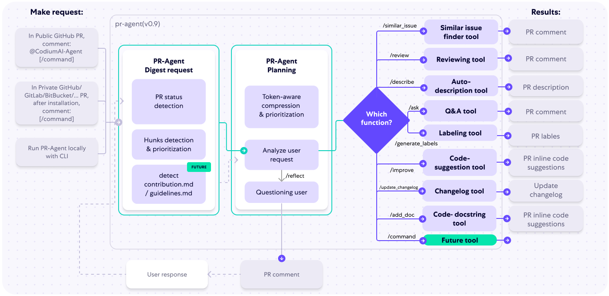
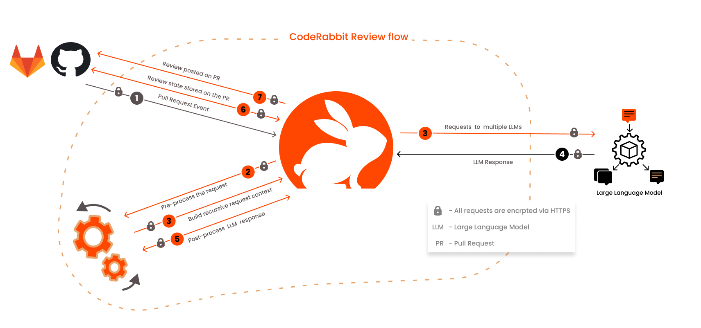

# AI 辅助软件工程：代码检视

CR（CodeReview）是代码指标保障中的重要一环，也是研发日常工作中的一个重要组成部分，我们希望通过对于CR过程和CR投入产出的情况进行分析，
评估当前CR工作的投入产出情况，驱动CR工作过程改进带来质量和效率的提升。

关键影响因素：

- CR评审需要快速响应，避免由于CR导致流程阻塞，一般应当在一个工作日内完成
- 挑选能对你代码做出最全面最准确评价的人为评审者，保障评审质量
- 避免单次提交过多代码，尽可能小的，增量的，实现一个完整功能的提交

## Why

结合《[How AI is Transforming Traditional Code Review Practices](https://coderabbit.ai/blog/how-ai-is-transforming-traditional-code-review-practices)
》的总结：

#### AI 在代码审查中的应用现状

代码审查是软件开发过程中至关重要的一环，传统上由人类开发者负责审阅代码，确保其符合编码标准，促进最佳实践，并在团队内部提升领域知识。然而，这个过程并不快速或完美。[据
SmartBear 对 Cisco Systems 编程团队的研究](https://smartbear.com/resources/case-studies/cisco-systems-collaborator)，审查
200-400 行代码通常需要 60 到 90 分钟，才能达到 70-90% 的缺陷发现率。尽管如此，软件开发人员普遍认为代码审查非常重要。

#### 传统代码审查的挑战

1. **时间限制**：开发人员常常时间紧迫，要同时处理多个任务和截止日期，全面的代码审查与这些宝贵的时间相竞争，可能导致项目延期或代码审查质量下降。
2. **认知偏见和可变性**：不同开发人员的思维方式不同，导致审查的一致性和深度存在较大差异。
3. **容易出错**：复杂或大型代码库中的微妙错误和依赖问题容易被忽视，导致漏洞和技术债务。
4. **知识孤岛**：技术知识往往在大型团队中被孤立，阻碍了对代码库的全面理解，降低了代码审查的效果。

#### AI 在代码审查中的作用

1. **自动化重复任务**：AI 可以自动化代码审查中的重复任务，如检查编码标准、文档和模板代码合规性，减轻人工审查者的认知负担。
2. **快速发现缺陷**：AI 可以在几分钟内扫描成千上万行代码，精准识别逻辑错误和复杂的安全漏洞，让人类审查者专注于更高层次的架构和设计考虑。
3. **一致性和客观性**：AI 不会受到情绪和偏见的影响，能够以统一的标准审查每一行代码，确保审查的一致性。
4. **即时反馈**：AI 能够实时分析代码并提供反馈，帮助开发人员在代码审查讨论的上下文中立即识别问题，减少后期修复错误的成本和努力。
5. **学习和适应**：先进的 AI 系统可以从过去的审查、开发人员的修正和不断变化的编码实践中学习，提供越来越相关和准确的反馈。
6. **知识共享和增强**：AI 可以整合代码库和外部来源的见解，提供最佳实践建议、编码技巧，甚至提供类似项目的示例，打破知识孤岛，促进持续学习和改进的文化。

#### AI 驱动的代码审查的未来

AI 技术在代码审查过程中的集成不仅是增量改进，而是一种变革性变化。当前的 AI 技术可以充当软件开发团队的助手，加速并分担繁琐的手动分析和错误发现工作。未来的进步将使
AI 演变成一个协作者，能够进行更复杂的推理，提供设计建议、最佳实践，甚至预测或模拟代码变更对软件功能和性能的影响。

通过深度洞察代码质量、提供个性化反馈，AI 将在开发团队中树立学习和改进的文化。要充分实现 AI 在代码审查中的潜力，需要有意识地整合
AI 和人类开发人员之间的持续合作。软件开发的未来光明，AI 无疑是这一前景的领先力量。

#### 总结

未来的代码审查将越来越依赖于 AI 技术，通过自动化重复任务、快速发现缺陷、一致性和即时反馈，AI
将显著提高代码审查的效率和质量。然而，人类开发者的直觉、创造力和经验仍然是不可替代的，AI 和人类的协同合作将引领软件开发进入一个新的时代。

## 示例

### Codium PR-Agent

> [CodiumAI](https://github.com/Codium-ai/pr-agent) PR-Agent aims to help efficiently review and handle pull requests,
> by providing AI feedbacks and suggestions

PR Agent



在处理PR（Pull Request）时，有两种常见情况：

1. PR足够小，可以放入一个提示中（包括系统提示和用户提示）。
2. PR太大，无法放入一个提示中（包括系统提示和用户提示）。

针对这两种情况，我们首先采用以下策略：

#### 仓库语言优先策略

我们根据以下标准优先考虑仓库的语言：

1. 排除二进制文件和非代码文件（例如图片、PDF等）。
2. 确定仓库中使用的主要语言。
3. 按仓库中最常见的语言对PR文件进行排序（按降序排列）：
   ```plaintext
   [[file.py, file2.py], [file3.js, file4.jsx], [readme.md]]
   ```

#### 小型PR

对于小型PR，我们可以将整个PR放入一个提示中：

1. 排除二进制文件和非代码文件（例如图片、PDF等）。
2. 扩展每个补丁周围的上下文至补丁上方和下方各3行。

#### 大型PR

##### 动机

大型Pull Request可能非常长，并包含大量信息，其相关程度对pr-agent而言各不相同。我们的目标是能够在单个LMM提示中尽可能多地打包信息，同时保持信息的相关性。

##### 压缩策略

我们优先考虑添加内容而不是删除内容：

- 将所有删除的文件合并到一个列表中（deleted files）。
- 文件补丁是块的列表，移除文件补丁中所有仅删除类型的块。

##### 自适应和基于token的文件补丁适配

我们使用tiktoken在上述修改后对补丁进行标记，并使用以下策略将补丁适配到提示中：

1. 在每种语言内，我们按文件中的token数量对文件进行排序（按降序排列）：
   ```plaintext
   [[file2.py, file.py], [file4.jsx, file3.js], [readme.md]]
   ```
2. 按上述顺序遍历补丁。
3. 将补丁添加到提示中，直到提示达到最大token长度的一定缓冲区。
4. 如果仍有剩余补丁，则将剩余补丁作为一个名为“其他修改文件”的列表添加到提示中，直到提示达到最大token长度（硬停止），并跳过其余补丁。
5. 如果尚未达到最大token长度，则将删除的文件添加到提示中，直到提示达到最大token长度（硬停止），并跳过其余补丁。

#### 示例

通过上述策略，我们可以有效地压缩和管理PR内容，使其适合在提示中使用，并确保信息的相关性和完整性。


### 示例：CodeRabbit

CodeRabbit是一款先进的AI驱动代码审查工具，旨在对拉取请求（PR）和合并请求（MR）提供快速且有上下文意识的反馈。它显著减少了手动代码审查所需的时间和精力，
提供了一个新的视角，并且经常能发现人眼容易忽略的问题。开发者可以直接在代码中与机器人互动，提供额外的上下文、提出问题或生成代码。系统通过学习用户的反馈不断改进。

AST 解析：[ast-grep](https://ast-grep.github.io/guide/rule-config.html)  is a new AST based tool for managing your code,
at massive scale.



#### Code Review 配置示例

CodeRabbit 基于抽象语法树 (AST) 模式提供审查指令。在底层实现上，CodeRabbit 使用 ast-grep 来支持这一功能。ast-grep 是用 Rust
编写的，并使用 tree-sitter 解析器为多种流行语言生成 AST。

```yaml
#...
reviews:
  #...
  path_instructions:
    - path: "**/*.js"
      instructions: |
        Review the JavaScript code against the Google JavaScript style guide and point out any mismatches
    - path: "tests/**.*"
      instructions: |
        Review the following unit test code written using the Mocha test library. Ensure that:
        - The code adheres to best practices associated with Mocha.
        - Descriptive test names are used to clearly convey the intent of each test.
  tools:
    ast-grep:
      essential_rules: true # option to enable essential security rules
      rule_dirs:
        - "custom-name"
      packages:
        - "myorg/myawesomepackage" # custom package name following the format organization/repository
```

AST Grep 规则示例：

```yaml
rule:
  # atomic rule
  pattern: "search.pattern"
  kind: "tree_sitter_node_kind"
  regex: "rust|regex"
  # relational rule
  inside: { pattern: "sub.rule" }
  has: { kind: "sub_rule" }
  follows: { regex: "can|use|any" }
  precedes: { kind: "multi_keys", pattern: "in.sub" }
  # composite rule
  all: [ { pattern: "match.all" }, { kind: "match_all" } ]
  any: [ { pattern: "match.any" }, { kind: "match_any" } ]
  not: { pattern: "not.this" }
  matches: "utility-rule"
```

### Google 示例：DIDACT

- [AI-Assisted Assessment of Coding Practices in Modern Code Review](https://arxiv.org/abs/2405.13565)
- [Resolving code review comments with ML](https://research.google/blog/resolving-code-review-comments-with-ml/)
