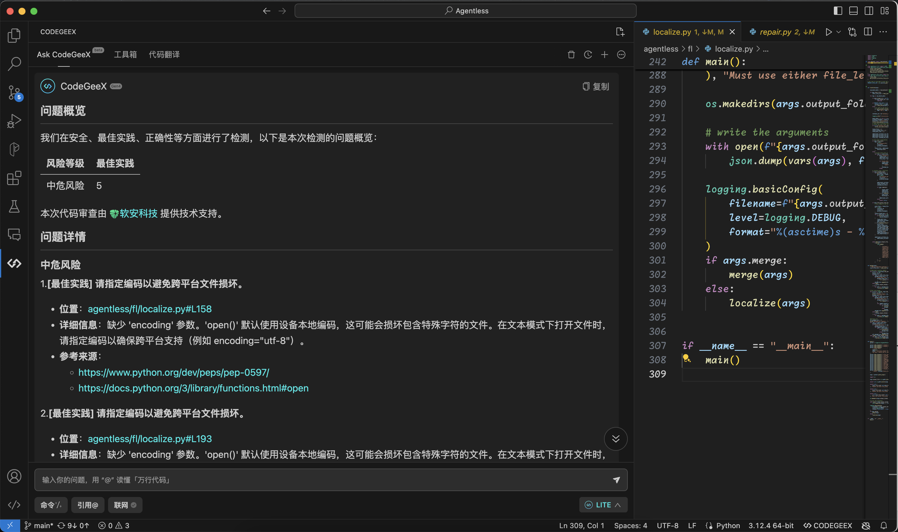
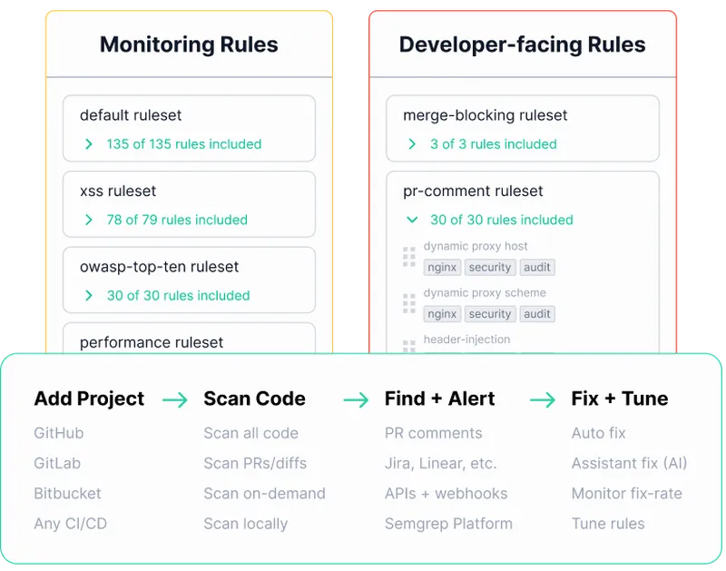

# AI 辅助软件工程：AI 辅助软件质量

正如 CodeScene
的文章[Use Guardrails for AI-Assisted Coding](https://codescene.com/blog/use-guardrails-for-ai-assisted-coding)）所总结：

在未来几十年里，人机协作编写代码的模式将逐渐成为主流。在这种趋势下，人们很容易错误地将代码编写的速度等同于生产力。为了在尽可能降低风险的同时，充分发挥
AI 辅助编码的积极作用，需要做到以下几点：

1. **设定现实的期望**：AI 辅助编程能高效完成特定任务，但因其一致性和正确性尚有不足，无法完全替代人类程序员。我们应承认这些限制，并专注于如何增强而非替代人类程序员的工作。同时，确保所有
   AI 生成的代码都经过严格的测试覆盖。
2. **将代码质量设为关键绩效指标（KPI）**：对人类和机器均应执行最低质量标准。在交付流程中，实施自动化质量检查，确保代码质量。使用可靠且经过验证的指标，以最大限度地提高信号的准确性并减少误报。
3. **进行持续的代码检查**：AI 生成的代码需要被团队充分理解和审查。绝不能接受团队无法掌握或未经审查的代码。通过可视化手段，监控整个团队的代码熟悉度，以便及时发现并解决潜在的知识孤岛。
4. **认识到理解代码的重要性日益提升，而不仅仅是编写代码**：理解AI生成的代码将成为一项关键技能。因此，确保流程、实践和培训能够适应这一变化，以提升团队能力。

正如大家所见，在 AI 辅助编码领域，存在一个共同的主题。要想取得成功，必须让具备专业技能的人类参与其中，并且引入专门的工具与流程，以确保代码库的持续健康。
探索这一新兴领域，意味着必须重新关注代码质量和持续学习。这一点至关重要。

## 0. 将代码质量设为关键绩效指标（KPI）

GitClear
报告《[Coding on Copilot: 2023 Data Suggests Downward Pressure on Code Quality](https://www.gitclear.com/coding_on_copilot_data_shows_ais_downward_pressure_on_code_quality)》

GitClear 分析了大约 1.53 亿行代码更改，这些更改发生在 2020 年 1 月至 2023 年 12 月之间。这是迄今为止已知最大的高度结构化代码更改数据库，用于评估代码质量差异。
研究发现，在可维护性方面出现了令人不安的趋势。代码返工率（Churn）——即在编写后不到两周内被撤销或更新的代码行百分比——预计到 2024
年将比 2021 年的 AI 应用前基准翻一番。

此外，研究还发现，“新增代码”和“复制粘贴代码”的比例正在增加，相对于 “更新”、“删除”和“移动”的代码。在这方面，2023
年生成的代码更像是流动贡献者的作品， 容易违反访问过的仓库的DRY（Don't Repeat Yourself）原则。

GitClear将代码变更分为七个类别（研究中涉及前六种）：

1. 新增代码：首次提交的代码行，代码行是全新的，不包括对现有代码行的小幅修改，也不包括那些被添加、移除后又重新添加的代码行。
2. 删除代码：被删除并提交的代码行，且至少在随后的两周内未被重新加入。
3. 移动代码：将一行代码剪切并粘贴到新文件或同一文件内的新函数中。「移动」的操作仅涉及位置的变换，代码内容不发生改变。
4. 更新代码：修改大约三个或更少的单词来更改原有代码行。
5. 查找/替换代码：从三个或更多位置移除相同字符串，并用一致的内容进行替换。
6. 复制/粘贴代码：在一次提交中，将相同的代码行内容复制到多个文件或函数中。
7. 无操作代码：指一些微小的代码变更，比如空格或同一代码块内行号的变化。

2022 至 2023 年间，AI 助手的崛起与仓库中错误代码的增加密切相关。

- **代码返工率的上升趋势**。代码返工率是指代码在推送到代码仓库后，两周内被撤销、移除或更新的比例。此前，当开发者完全自主编写代码时，代码搅动较为罕见，通常在
  3-4% 之间。然而，随着 AI 助手如 Copilot 和 ChatGPT 的广泛应用，代码搅动率显著上升，2023 年达到了 9%。这种上升趋势表明 AI 生成代码的增加与错误代码的生成密切相关。
  报告预测，如果这种趋势持续下去，2024年代码更改的撤销比例可能会超过7%，这将是2021年的两倍。
- **代码移动的减少与重构和复用的减少**。代码移动通常伴随着代码系统的重构，反映了开发者对已有代码的重新组织和复用。重构和复用能够提高代码的稳定性和可理解性。
  然而，2023年，随着AI助手的广泛应用，代码移动减少，这表明开发者更倾向于复制粘贴代码而非重构。这种变化可能是因为 AI 助手提供了更简单的方式来生成代码，
  而非鼓励开发者复用已有代码。这一趋势可能导致开发团队在未来面临更多维护挑战。
- **复制粘贴代码的增加与维护困难**。复制粘贴代码的增多可能对代码的长期可维护性产生重大影响。当开发者选择复制粘贴而非复用现有代码时，
  意味着他们没有充分评估现有实现的有效性。随着时间的推移，这种重复代码会增加系统复杂性，增加维护成本。特别是在缺乏经验的团队中，
  可能没有足够的资源和权威来删除重复的代码，从而导致技术债务的积累。如果管理层不主动安排时间解决这些问题，代码库中的复制粘贴代码将会继续存在，
  进一步阻碍未来的开发速度。

## 1. 结合经典工具/SAAS 服务，改善 AI 代码质量

经典工具：sonarqube

SaaS 服务：Codacy、CodeScene、Code Climate

### CodeScene 示例

[CodeScene](https://codescene.com/blog/use-guardrails-for-ai-assisted-coding) 构建的 AI
辅助代码防护措施框架。它建议在三个方面发挥作用：代码质量、代码熟悉度和强大的测试覆盖率，以确保正确性：

- 防护措施：代码质量。高质量的代码一直是企业的竞争优势，能够缩短开发周期并减少生产缺陷。这样的代码更容易理解，因此在需要修改时更安全、更具成本效益。对AI生成的代码保持同样的标准可以减轻多种风险。
- 防护措施：代码熟悉度。第二个防护措施涉及确保代码熟悉度的流程和实践。[研究表明](https://arxiv.org/abs/2304.11636)
  ，当开发人员处理之前没有看过的代码时，解决大型任务所需的时间可能增加93%——这是入职的成本。在拥抱AI时，我们开发人员不断面对新的和不熟悉的代码。因此，我们必须确保每个开发人员也能对生成的代码建立强烈的熟悉感。
- 防护措施：测试覆盖率。如上所述，AI助手经常生成不正确的代码。我们常说大语言模型并不是真正有创意的，但在进行我们的AI研究后，我不得不同意：AI破坏我们代码的方式是没有限制的。
  有些是微妙的，比如否定一个逻辑表达式，另一些则非常糟糕（比如删除JavaScript代码中的`this`
  关键字，根本上改变了函数的意义）。强大的自动化测试在这里提供了急需的保护。而且——测试不应该从代码中由AI生成。这样做就错过了测试的双重记账功能。（例如，谁来测试测试？）。

如下图所示：

### Amazon CodeGuru Reviewer 示例

Amazon CodeGuru Reviewer 是一项使用程序分析和机器学习来检测开发人员难以发现的潜在缺陷，并为改进 Java 和 Python
代码提供建议的服务。通过主动检测代码缺陷，CodeGuru Reviewer 可以提供解决这些问题的指导方针，并实施最佳实践，以在代码审查阶段提高代码库的整体质量和可维护性。

[How Amazon CodeGuru Reviewer works](https://docs.aws.amazon.com/codeguru/latest/reviewer-ug/how-codeguru-reviewer-works.html)

### CodeGeeX：结合 SAAS 服务，静默守护代码质量

## 2. 质量左移：在结合日常开发活动

诸如 CodeReview 、测试生成

- 指标如修复率和对发现结果展示的控制，使得随着时间的推移， 非专业人士也能轻松提升您的应用安全程序。
- 在一个地方管理所有发现结果，可以根据项目、严重性、分支或特定规则集进行筛选。
- 与 Jira 和 Slack 集成，或使用我们的 API 直接连接到您的安全警报工具/仪表板。

## 3. 持续数据运营，构建专有保障模型

## 示例

### 案例：Semgrep

[Semgrep Assistant](https://semgrep.dev/products/semgrep-code/assistant) 助力应用安全工程师和开发者更快做出正确决策，减轻认知负担。这意味着用户只需将时间和分析精力集中在需要关注的问题上。

- 优化自动分类结果。Semgrep Assistant 利用 GPT-4 对代码的理解能力，结合针对 Semgrep 规则的特定提示，判断安全发现的误报情况。建议包括上下文和推理，使开发者能够快速轻松地验证建议/修复的正确性。
- 自动修复代码。当 Semgrep Assistant 确定一个真实的安全问题时，它会推荐自动修复方案。通过次级提示审查差异，减少幻觉现象。生成的修复方案易于验证，即使工程师需要额外输入，也对他们有所帮助。
- 使用自然语言生成自定义规则。Assistant 能够编写自定义规则，以识别针对您代码库的特定模式或漏洞。您只需提供一份“不良代码”示例、一份“良好代码”示例，以及用人类语言描述您希望规则执行的操作即可。
- 培养安全设计意识。推动开发者对安全编码原则的认识。除了减少开发者寻找信息的时间外，Semgrep 提供的上下文和可解释性确保开发者能够随着时间的推移，学习和提升他们对安全编码实践的理解。

### 案例：TestSpark

[TestSpark](https://github.com/JetBrains-Research/TestSpark) 是一个用于生成单元测试的插件。TestSpark 能够在 IDE 中原生集成多种基于
AI 的测试生成工具和技术。

Paper: [TestSpark: IntelliJ IDEA’s Ultimate Test Generation Companion](https://arxiv.org/html/2401.06580v1)

TestSpark 目前支持两种测试生成策略：

1. 基于大语言模型（LLM）的测试生成（使用 OpenAI 和 JetBrains 内部的 AI Assistant 平台）
2. 基于局部搜索的测试生成（使用 EvoSuite）

#### 基于大语言模型的测试生成

对于这种测试生成方式，TestSpark 向不同的大语言模型发送请求。此外，它会在向用户展示测试之前自动检查测试是否有效。

此功能需要从 OpenAI 平台或 AI Assistant 平台获取一个 token。

- 支持任何版本的 Java。
- 生成用于捕获故障的单元测试。
- 为 Java 类、方法和单行代码生成测试。

#### 基于本地搜索（search-based）的测试生成

对于此类测试生成方法，TestSpark 采用了 EvoSuite，这是目前最强大的基于搜索的本地测试生成工具。

- 它只支持 Java 11 **及以下**版本。
- 根据多样的测试标准生成测试用例，包括行覆盖率、分支覆盖率、I/O 多样性、异常覆盖率和变异得分。
- 能够生成用于检测故障的单元测试。
- 为 Java 中的类、方法以及单行代码提供测试生成服务。

### 案例：UnitTestBot

[UnitTestBot](https://github.com/UnitTestBot)

Java 版本：[UnitTestBot](https://github.com/UnitTestBot/UTBotJava)

我们是一支分布式的研究人员和工程师团队🙋‍。

我们所有人都对数学和编程充满热情。我们热衷于参加软件测试[比赛](https://ieeexplore.ieee.org/document/9810769)
并在[研究文章](https://www.utbot.org/research)中描述我们的成就。

我们的主要项目是我们的旗舰产品——[UnitTestBot](https://www.utbot.org/)，它支持Java/Kotlin、C/C++、Python、JavaScript和Go语言。

为了保持与前沿科学的联系，我们与顶尖大学合作。作为校际团队的一部分，我们开发了根本技术，以增强UnitTestBot以及其他一系列软件产品。以下是其中一些：

#### 🤓 SAT求解技术

SAT求解器是一种计算机程序，用于确定给定布尔公式的变量是否可以一致地替换为_True_或_False_，从而使公式的结果为_True_
。SAT求解器经常被用作程序验证应用程序的“引擎”。

- [KoSAT](https://github.com/UnitTestBot/kosat)是一个基于MiniSat核心的纯Kotlin CDCL
  SAT求解器。它解决以DIMACS格式给定的布尔可满足性问题，并支持增量求解。
- 我们还研究了与SAT求解相关的[更广泛的理论问题](https://www.utbot.org/research)，例如评估给定SAT问题的计算难度。

#### 🧐 SMT求解技术

可满足性模理论（SMT）研究领域涉及确定逻辑公式是否可满足。

[KSMT](https://github.com/UnitTestBot/ksmt)是各种SMT求解器的Java/Kotlin门面。目前，它支持Z3和Bitwuzla SAT求解器。

#### 😎 符号执行

利用SAT和SMT求解器，我们开发了符号执行技术，以为我们的精确代码分析和自动化测试生成工具提供有效的引擎。在这个研究领域，我们有三个主要解决方案。

- [UnitTestBot Java](https://github.com/UnitTestBot/UTBotJava)
  有自己的动态符号执行引擎，已在[SBST比赛](https://ieeexplore.ieee.org/document/9810769)中表现出色。
- 我们为KLEE定制的补丁是[UnitTestBot C/C++](https://github.com/UnitTestBot/UTBotCpp)
  的核心。KLEE是一个基于LLVM编译器基础架构的符号虚拟机。我们通过实现补丁来[贡献给KLEE](https://github.com/UnitTestBot/klee)
  ，提高引擎的代码覆盖率和速度。我们提出了_懒初始化改进_，并向主KLEE分支提交了_未定义行为检测补丁_以及_内联汇编支持补丁_。
  我们将KLEE转换为_双向属性导向符号执行_引擎。此外，补丁后的KLEE引擎能够自动推导方法摘要。
- 我们还计划通过[V#](https://github.com/VSharp-team/VSharp)支持.NET基础架构——这是一个完全自动化测试生成的符号执行引擎。

符号执行是我们的主要关注点，因此我们进行了[一系列研究](https://www.utbot.org/research)，涉及该领域的应用和基础问题。

#### 🤪 模糊测试

在开发UnitTestBot产品系列的过程中，我们开发了适用于所有支持语言（Java/Kotlin、C/C++、Python、JavaScript和Go）的[模糊测试和动态程序分析技术](https://github.com/UnitTestBot/UTBotJava/tree/pelevin/UnitTestBot_Family_Fuzzer_Platform/utbot-fuzzers)。

#### 🙂 程序分析

UnitTestBot及其符号执行引擎和模糊测试技术是[现成的](https://github.com/UnitTestBot/UTBotJava/wiki/Static-code-analysis-with-UTBotJava-action)
用于[代码分析](https://github.com/UnitTestBot/UTBotCpp/wiki/CodeAnalyzer)的工具。除了这一端到端解决方案外，我们还实现了一个开发自定义静态代码分析器的基本框架。

[Java编译数据库（JacoDB）](https://github.com/UnitTestBot/jacodb)受到了[Soot](https://github.com/soot-oss/soot)
框架的启发，用于分析和转换Java代码。

JacoDB是一个纯Java数据库，存储关于编译后的Java字节码的信息——类、层次结构、注释、方法、字段及其用法。使用JacoDB，可以分析JVM进程外的字节码。这使得UnitTestBot能够支持最新的JDK，并在重启之间重用数据。

#### 🙃 程序合成

我们研究合成代码以解决实际问题的方法。
例如，UnitTestBot能够基于公共API而不是反射[生成人类可读的测试方法体](https://github.com/UnitTestBot/UTBotJava/pull/1030)。

我们还开发了**genui**
项目——一个自动化UI生成工具。在我们的研究中，我们[探讨](https://icfp22.sigplan.org/details/minikanren-2022-papers/3/On-a-Declarative-Guideline-Directed-UI-Layout-Synthesis)
了根据指定的设计指南自动排列用户界面元素的方法。下一步是合成能够实现此布局的代码。
