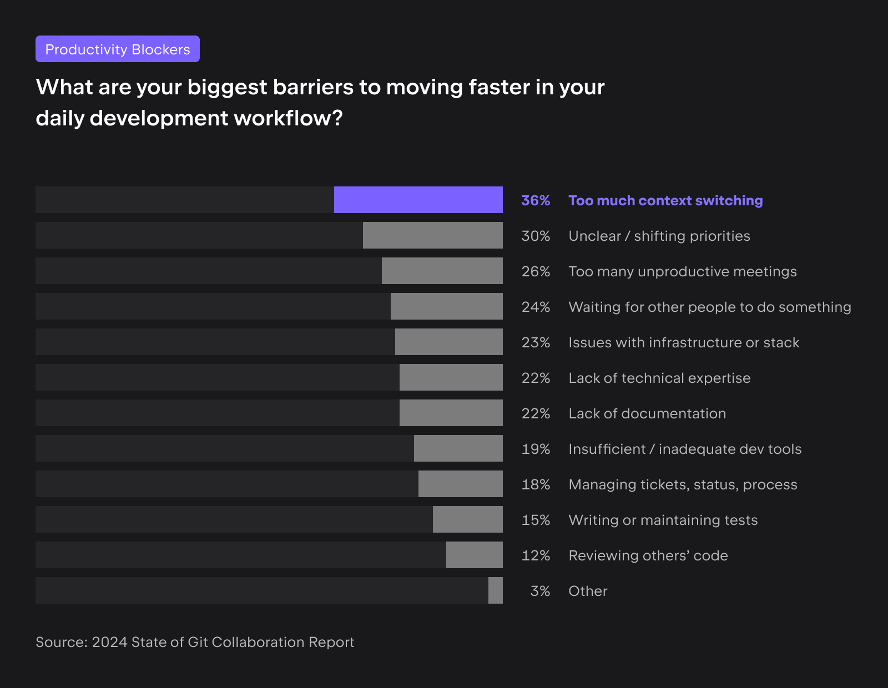

# AI 辅助软件工程：AI4SE 体系设计

受限于自身企业的规模与人员结构，AI 辅助软件工程（AI4SE）的设计与实施过程会有所不同。诸如于：

- 研发外包型企业，对于 AI 辅助研发的需求并没有特别强烈？（待进一步调研）
- 小型研发组织，生存是主要问题，因此对于数据敏感度不高，可以采用 SaaS 方案；当团队中出现能力较强的人员时，会基于开源工具进行简单的开发。
- 中大型研发组织，对于数据敏感度较高，因此会选择自建 AI4SE 体系，以保证数据的安全性。

结合我们在其它组织的经验，以及 AI 给我们的建议，我们可以得到以下的 AI4SE 体系设计流程：

1. **明确 AI4SE 设计目标**：确定通过 AI 实现的可落地目标，如提高开发效率和提升代码质量。
2. **识别痛点和需求**：评估当前软件工程流程中的痛点和瓶颈。
3. **选择合适的AI技术**：根据业务需求选择合适的 AI 技术，如机器学习、深度学习、自然语言处理等。
4. **构建跨学科团队**：组建包含数据科学家、AI 工程师、软件工程师和业务专家的团队，并提供AI相关培训。
5. **开发原型与集成**：开发和测试 AI 应用的原型，并将有效模型集成到现有工具链中。
6. **逐步实施与评估**：采用小规模试点逐步扩大的策略，并定期评估体系绩效，使用关键绩效指标进行衡量。
7. **持续改进与技术更新**：收集用户反馈，持续优化AI模型和工具，并跟踪引入最新 AI 技术和方法，确保数据质量和安全。

设计适合自身公司的 AI4SE 体系是一项复杂且难度极大的工作。这一过程需要综合考虑公司的具体情况、业务需求以及现有的资源。

## AI4SE 工具链

市面上的工具示例。

| 环节      | 头部                  | 工具                                           | 特点                                                                                | 典型工具                                                          |
|---------|---------------------|----------------------------------------------|-----------------------------------------------------------------------------------|---------------------------------------------------------------|
| 需求/项目管理 | Atlassian           | Jira AI Assistant, Atlassian Intelligence    | 构建交互式 AI 需求编辑器，提升需求编写效率。扩大生成式 AI 使用触点，提供 AI 跨工具链能力。                               | Jira AI Assistant, Atlassian Intelligence                     |
| 开发与代码协作 | GitHub              | GitHub Copilot, Copilot X, Copilot Workspace | 围绕代码开发、协作、构建为核心，以开发者体验作为度量体系；                                                     | GitHub Copilot, Copilot X, Copilot Workspace, Dynatrace Davis |
| CI/CD   | GitHub, GitLab      | GitHub Action, GitLab                        | 结合代码平台，构建更符合开发者体验的开发体系                                                            |                                                               |
| 测试      | JetBrains           | Checksum, Testim Copilot                     | 生成式 AI 测试工具，提供测试用例生成、自动化测试、测试报告等功能。                                               | Testim                                                        |
| 文档与协作   | Atlassian           | Atlassian Rovo                               | 通过生成式 AI 解锁企业知识的工具，内建和自定义知识管理智能体。                                                 | Atlassian Rovo                                                |
| 基础设施    | AWS/Sysdig          | Amazon Q, Sysdig Sag                         | 在云平台上，关注在 AI 重新定义"安全左迁"。结合生成式 AI 与传统 AI 工具，进行云基础设施排错、问答、网络诊断等。结合云平台，提供对应 AI 辅助能力。 | Amazon Q, Sysdig Sag                                          |
| 可观测性    | New Relic/Dynatrace | NewRelic Grok, Dynatrace Davis               | 结合传统判别式 AI 工具，无缝辅助问题定位和修复，与问题回顾。围绕新兴 AI 技术栈构建 AI 应用可观测性。                          | NewRelic Grok                                                 |
| 开发者工具   | JetBrains           | AI Assistant, Grazie                         | 围绕开发人员日常活动，构建全面的 AI 辅助；在 IDE 构建精确的上下文，以获得高质量生成内容。                                 | AI Assistant, Grazie                                          |

## 明确 AI4SE 设计目标

### AI 能力局限性

尽管生成式 AI 技术在软件工程领域的应用已经取得了显著进展，但在实际应用中，AI 技术的效果并不总是如人们所期望的那样。要意识到
AI 技术的局限性，以及在实际应用中可能遇到的挑战。只有在明确设计目标的基础上，AI 技术才能真正发挥其作用，提高软件工程的效率和质量。诸如于：

- **环境适配问题**。生成式 AI 可以根据一张图片生成前端代码，但由于每个企业内部使用的前端框架、组件库等不尽相同，生成的代码往往无法直接在实际项目中使用。这意味着，生成式
  AI 必须考虑到不同组织的技术栈和环境需求，才能真正发挥其作用。
- **代码质量不稳定**。由于生成式 AI 的固有限制，生成的代码质量并不总是稳定或符合最佳实践标准。在实际应用中，人工审核和质量保证仍然是必不可少的。这种人机协作的方式可以弥补
  AI 的不足，确保代码的可维护性和可靠性。
- **能力限制**。生成式 AI 更擅长生成新的代码，而不是修改现有的代码。这意味着在处理现有系统的维护和升级时，生成式 AI
  的作用可能有限。因此，AI 需要具备与现有代码库互动的能力，才能在实际应用中提供更大的价值。
- **上下文理解不足**。生成式 AI 在生成代码时，常常无法充分理解项目的整体上下文或业务逻辑。这种上下文理解的不足，可能导致生成的代码与项目
  AI 需要适当补充背景信息，才能更好地满足项目的实际需求。
- **复杂任务处理能力有限**。尽管生成式 AI 在简单的编码任务上表现出色，但在处理复杂的系统设计、架构决策或多模块集成时，其能力仍然有限。面对这些高复杂度的任务，生成式
  AI 可能需要更多的人工干预与支持。
- ……

我们需要明确知晓 AI 技术的局限性，以便在设计时，能够充分考虑到这些因素，避免过高期望和不切实际的目标设定。

### 设计可行的 AI4SE 目标

在了解 AI 能力局限性的基础上，设计可行的 AI4SE 目标至关重要。以下是一些建议：

1. 聚焦增量优化：目标应以提升现有流程和工具的效率为主，而非完全取代。AI 应该被视为开发人员的辅助工具，帮助他们减少重复性工作，从而专注于更具创意和复杂性的任务。
2. 分阶段实施：逐步引入 AI 技术，分阶段评估其效果和适应性。在初期，可选择影响较小的环节进行试点，如文档生成或简单代码片段生成，逐步扩展至更关键的开发环节。
3. 确保人机协作：设计目标时应考虑到人机协作的需求。AI 的输出需要与开发人员的工作流程紧密结合，并允许开发人员对 AI 生成的结果进行快速审查和修改。
4. 制定数据安全与隐私策略：根据组织的规模和敏感度，制定清晰的数据安全与隐私保护策略。对于中大型组织，特别是在数据敏感度高的情况下，自建 AI4SE 体系可能更为合适。
5. 定期评估与反馈机制：建立定期评估机制，收集用户的反馈，并根据实际使用情况调整 AI4SE 目标和策略。这样可以确保 AI 技术能够随着业务需求的变化不断优化和改进。

通过合理的目标设计和实施策略，AI4SE 体系可以有效提高软件工程的效率和质量，帮助企业在竞争激烈的市场中保持优势。

## 识别痛点和需求

### 基于 DevOps 流程分析

当企业构建成熟的 DevOps 流程时，AI4SE 的实施会更加顺利。下图是，Thoughtworks 在 2023 年初对 AI 辅助软件工程的流程分析，即在软件开发的不同阶段，AI
可以提供哪些辅助功能：


我们就可以探索如何在不同阶段使用 AI 工具，而在这时需要不同的角色参与到这个过程中，以确保我们设计出来的体系符合不同角色的需求。

### 基于数据分析

诸如于 JetBrains 和 GitKraken
的 [2024 State of Git Collaboration](https://www.gitkraken.com/reports/git-collaboration-2024) 年度报告，会指出：

- 较小的团队通常在敏捷性和满意度方面表现优于较大的团队。
- 团队成功的关键似乎在于团队成员数量与任务管理之间的平衡。

而其中会发现团队在上下文切换、不明确的优先事项和无效会议等方面存在问题，导致浪费时间和精力，真正在编码的时间不到总工作时间的
40%。



除此，再加上不明确的优先事项，使开发人员不确定哪些任务需要立即关注，这些陷阱可能会创造一个充满挑战的工作环境。
为了解决这些问题，团队应实施清晰的沟通渠道，以减少上下文切换的需求，并简化会议议程，以确保每次会议都有明确的目的和清晰的结果。

> "上下文切换、不明确的优先事项和那些永无止境的会议。它们感觉像是烦恼，而 GitKraken 的这份报告有数据证实它们确实是烦恼。作为开发人员和开发团队，
> 是时候寻找匹配我们需求的工具和工作流程，消除让我们不开心的噪音。进入状态，构建出色的软件！" —— GitKraken CEO：Matt
> Johnston

## 选择合适的AI技术

在原型开发阶段，可以尝试不同的AI技术，如机器学习、深度学习、自然语言处理等，以确定最适合公司需求的技术。 而在实际应用中，需要考虑
AI 模型与基础设施的集成、数据安全性、模型解释性等因素。

由于，大量的 AI 科研人员使用的是 Python 语言，已经有大量的 AI 开发框架和基础设施， 因此人们喜欢优先考虑 Python 作为 AI
开发语言。这种趋势也从科研和一些基础设施影响到了应用层。如在 2023 年，Python 生态下的 LangChain 和 LlamaIndex 是人们构建生成式
AI 的两个主要框架。

回到企业应用开发时，可能更倾向于使用 Java、C++ 或其他语言。 诸如于我们在设计 Unit Mesh 相关开源方案时，由于内部大量的基础设施是建立在
JVM 上，因此我们选择了 Kotlin 作为主要的开发语言，开发了对应的 LLM 开发框架 ChocoBuilder，以支持 AI 模型的快速构建。

如今不同的语言也有不同的 LLM 开发框架，如：Spring AI 。

## 构建跨学科团队

- AI 工程师与数据工程师不擅长软件工程
- 软件工程师不擅长 AI 与数据处理

## 开发原型与集成

基于反馈和数据驱动的方法，持续改进体系设计。

### 原型开发套件

诸如我们设计的：[ChocoBuilder](https://github.com/unit-mesh/choco-builder) 可以帮助开发人员快速构建原型，以验证 AI 模型的有效性。

```kotlin
@file:DependsOn("cc.unitmesh:rag-script:0.4.6")

import cc.unitmesh.rag.*

rag {
    indexing {
        val chunks = document("README.md").split()
        store.indexing(chunks)
    }

    querying {
        store.findRelevant("workflow dsl design ")
            .lowInMiddle()
            .also {
                println(it)
            }
    }
}
```

## 逐步实施与评估

设计度量体系

## 持续改进与技术更新


