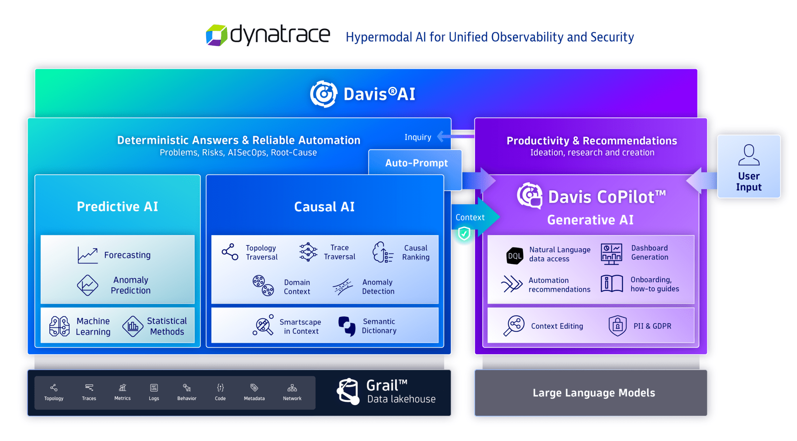
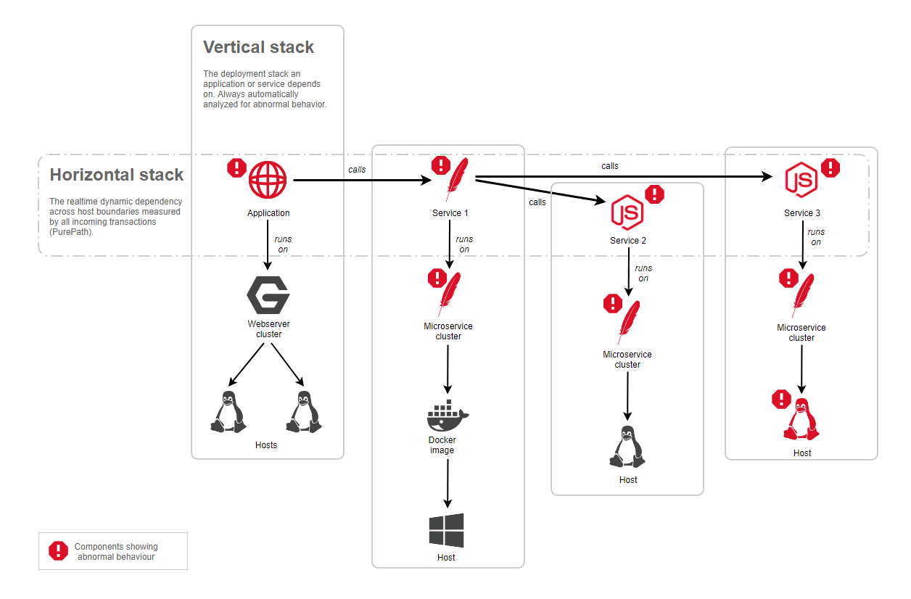
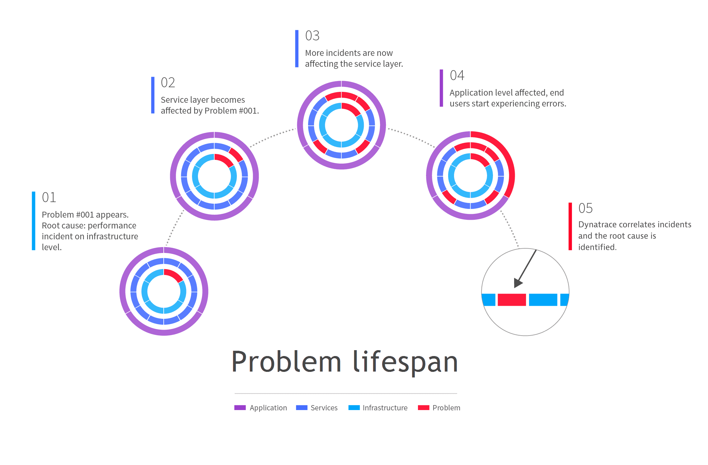
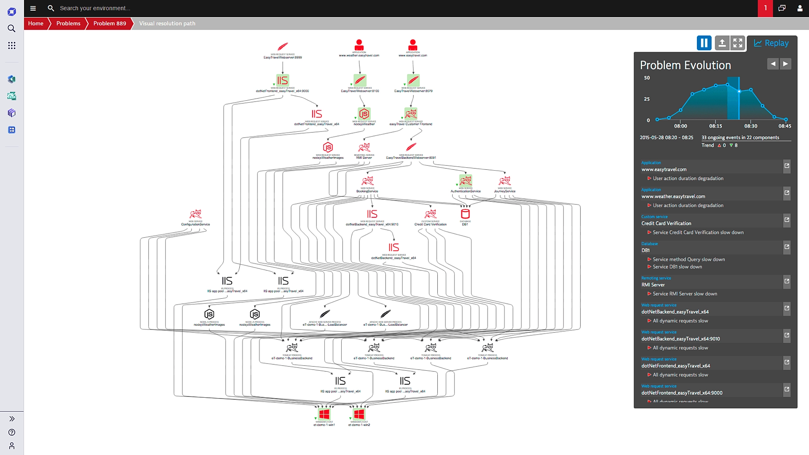
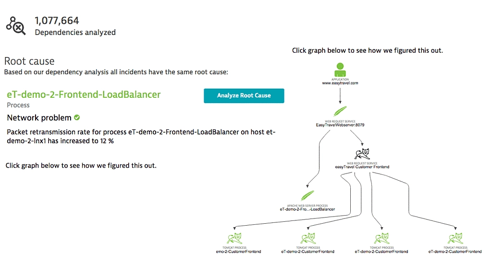

# AI 辅助软件工程：AI 辅助根因分析生成

核心技术：

- 智能调度核心：体系链路完善的调度核心、多模式一键配置
- 代码整库分析：仓库级代码理解、项目文件级代码编写生成
- 文档分析增强：文档知识库结合知识图谱的检索、推理增强
- 垂类专属知识：DevOps 专属知识库、垂类知识库自助一键构建
- 垂类模型兼容：DevOp s领域小模型、DevOps 周边平台兼容

## 示例

### New Relic AI: observability assistant

[Meet New Relic AI, your observability assistant](https://docs.newrelic.com/docs/new-relic-solutions/new-relic-one/core-concepts/new-relic-ai/#synthetic)

New Relic AI 旨在通过将大型语言模型 (LLMs) 与 New Relic 的数据平台相结合，帮助用户理解和管理他们的系统。这个 AI
助手可以用简单的语言回答问题，提供见解，并协助完成诸如故障排除、创建 NRQL 查询、分析错误日志、管理警报和配置合成监控等任务。

**主要功能：**

1. **聊天界面：** 在 New Relic 平台的多数页面中，通过聊天功能与 New Relic AI 进行互动。提出问题，获取关于系统性能和故障排除的见解。
2. **NRQL 查询：** 使用AI助手创建 NRQL（ New Relic Query Language ）查询，以分析系统数据，无需手动编写查询语句。
3. **错误分析：** 从日志和堆栈跟踪中获取错误的摘要和详细信息。
4. **警报管理：** 识别警报覆盖的空白，确保所有实体和服务得到监控。
5. **合成监控：** 设置合成监控，以检查 URL 的可用性和性能。
6. **支持工单：** 汇总并检查支持工单的状态，以便快速解决。
7. **仪表板分析：** 从仪表板中获取摘要和见解，以了解和调查遥测数据。

#### [AI Monitoring](https://newrelic.com/platform/ai-monitoring)

#### 应用数据 NRQL 查询示例

你可以使用 NRQL 查询从应用程序监控、浏览器监控和移动端监控中收集到的数据。通过这些数据，你可以回答各种问题。以下是一些基本的示例。

**唯一用户**。上周你有多少独立用户会话？

```sql
SELECT uniqueCount(session) FROM PageView SINCE 1 week ago
```

**唯一用户趋势**。与前一周相比，上周的独立用户会话数量是增加了还是减少了？

```sql
SELECT uniqueCount(session) FROM PageView SINCE 1 week ago COMPARE WITH 1 week ago
```

**页面浏览趋势**。如何绘制昨天与前天相比的独立用户数量图表？

```sql
SELECT count(*) FROM PageView SINCE 1 day ago COMPARE WITH 1 day ago TIMESERIES AUTO
```

**操作系统版本**。有多少移动端用户使用的是最新的操作系统版本？

```sql
SELECT uniqueCount(uuid) FROM MobileSession FACET osVersion SINCE 7 days ago
```

**关键账户的 Apdex**。某个重要客户的 Apdex 得分是多少？如果你定义了一些自定义属性，你可以查询以监控该客户在应用中体验的性能情况：

```sql
SELECT apdex(duration, t: 0.4) FROM Transaction WHERE customerName='ReallyImportantCustomer' SINCE 1 day ago
```

### Dynatrace



####  Automatic root-cause analysis

根本原因分析利用所有可用的上下文信息——如拓扑结构、事务和代码级别信息——来识别具有相同根本原因和影响的事件。

仅凭时间相关性不足以确定问题的根本原因。Dynatrace
采取了一种上下文感知的方法，检测跨越时间、进程、主机、服务、应用程序以及垂直和水平拓扑监控视角的相互依赖事件。这种方法将多个独立异常整合为单一一致的问题，
大幅降低了警报负载。

下图展示了 Davis
如何分析问题的所有水平和垂直依赖关系。在此示例中，应用程序表现出异常行为，而底层的垂直堆栈运行正常。分析跟踪应用程序的事务，
检测到对某个服务（服务1）的依赖，该服务也表现出异常行为。反过来，该服务的所有依赖项也表现出异常，并且都是同一问题的组成部分。



#### Problem Lifecyle

当 Dynatrace 接收到首个事件指标，表明出现异常行为时，如服务减慢、节点饱和或工作负载崩溃并重启，它会立即开启一个问题。
问题会自动遵循一个生命周期，并在仍有受影响的实体处于不健康或异常状态时保持活动状态，这通常由一个活跃事件来表示。

在以下场景中，基础设施层的一个性能事件是问题的根本原因：



问题生命周期：

1. Dynatrace 检测到基础设施层的性能事件，并创建一个新的问题以进行跟踪。同时，也会发送通知。
2. 几分钟后，基础设施问题导致应用程序的某个服务出现性能下降问题。
3. 开始出现更多服务层的性能下降问题。最初仅限于基础设施的问题，现在已经发展成一系列服务层问题，每个问题都源于基础设施层的原始事件。
4. 最终，服务层问题开始影响通过桌面或移动浏览器与应用程序互动的客户体验。在问题生命周期的这个阶段，您面临的是一个应用程序问题，其根本原因在于基础设施层，同时服务层也有额外的原因。
5. 由于 Dynatrace 了解您环境中的所有依赖关系，它能够将客户体验的性能下降问题与基础设施层的原始性能问题关联起来，从而促进快速解决问题。

##### Cut down your mean time to repair by 90% or more

性能问题很少是孤立的一次性事件，它们通常是更大问题的症状。Dynatrace 的人工智能分析了数十亿次事件，帮助您解决问题的根本原因，而非仅仅应对症状。

- 人工智能能够理解整个 IT 环境中的因果关系。
- 只有 Dynatrace 能够可靠地发现性能问题的根本原因。
- 通过深入分析源代码和数据库语句，您可以先行一步进行故障修复。



Dynatrace 的根本原因分析提供了即时回放功能，它能直观地展示问题是如何逐步发展的。通过这种方式，用户可以迅速定位并解决问题。

##### 可视化方式

在处理高度复杂的问题时，他巧妙地运用了视觉化的手段。在当今日益复杂且高度动态的环境中，应用程序的依赖关系远超个人能够通过传统监控工具有效分析的范围。

- Dynatrace 的人工智能能够自动且持续地在弹性应用环境中检测因果关系。
- 利用应用程序问题的即时回放功能，详细观察您的环境中的各个组件随时间如何受到影响。
- 查看一个互动式信息图表，它会告诉您问题出在哪里以及您可以采取哪些措施。



#### DQL

Total number of open vulnerabilities

```SQL
fetch events
| filter dt.system.bucket=="default_security_events"
     AND event.provider=="Dynatrace"
     AND event.type=="VULNERABILITY_STATE_REPORT_EVENT"
     AND event.level=="ENTITY"
// filter for the latest snapshot per entity
| dedup {vulnerability.display_id, affected_entity.id}, sort:{timestamp desc}
// filter for open non-muted vulnerabilities
| filter vulnerability.resolution.status=="OPEN"
     AND vulnerability.parent.mute.status!="MUTED"
     AND vulnerability.mute.status!="MUTED"
// count unique vulnerabilities
| summarize {`Open vulnerabilities`=countDistinctExact(vulnerability.display_id)}
```