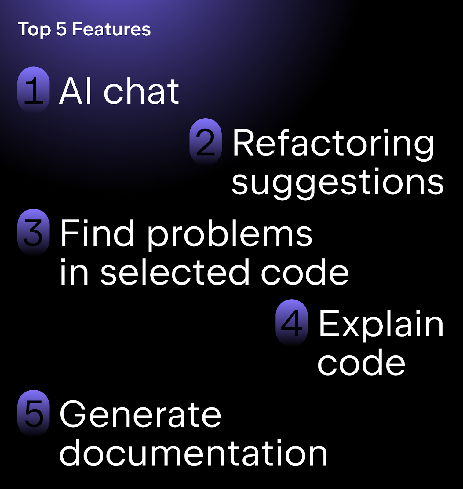

# AI 辅助开发

## 数据驱动的需求

### Google 智能粘贴

[Smart Paste for context-aware adjustments to pasted code](https://research.google/blog/smart-paste-for-context-aware-adjustments-to-pasted-code/)

对 Google 单体代码库（Google 的代码库，存储完整的工作历史，而不仅仅是提交的更改）的分析揭示了用户行为中一些有趣的模式，这些模式是提高效率的潜在目标。
例如，根据编辑历史记录，约 25% 的粘贴内容会立即进行修改，这些修改范围从小的语法修正（例如，添加缺失的分号）到更复杂的适应周围代码环境的调整
（例如，重命名变量和更改其类型）。进行此类更改通常会打断代码创作的流程并减慢开发过程。

考虑到这一点，我们推出了Smart Paste，这是一种现在在 Google 广泛使用的工具，它可以预测代码环境的下一状态，并使用生成式 AI 对粘贴的代码进行上下文感知的调整。
利用大序列模型的最新进展——例如DIDACT，该进展使代码审查、构建修复等工具成为可能——Smart Paste 简化了代码修订过程中的复制粘贴流程。
在一项涵盖约 4 万名采用该功能的工程师的使用研究中，我们发现 6.9% 的 IDE 粘贴操作使用了 Smart Paste，并且有 42.5% 的接受率，这显著简化了用户的工作流程。

### JetBrains 报告

[Developers save up to 8 hours per week with JetBrains AI Assistant](https://blog.jetbrains.com/ai/2024/04/developers-save-up-to-8-hours-per-week-with-jetbrains-ai-assistant/)

JetBrains Top 5 Features:

## 架构

### 跨 IDE 设计

[The Self-Driving IDE is Coming](https://sourcegraph.com/blog/the-self-driving-ide-is-coming)

| Features x IDEs     | VS Code | JetBrains | Neovim | Xcode | Emacs | Android Studio | … |
|---------------------|---------|-----------|--------|-------|-------|----------------|---|
| Chat                |         |           |        |       |       |                |   |
| Completions         |         |           |        |       |       |                |   |
| Commands            |         |           |        |       |       |                |   |
| Inline Edits        |         |           |        |       |       |                |   |
| Chat history        |         |           |        |       |       |                |   |
| Enterprise controls |         |           |        |       |       |                |   |
| Custom prompts      |         |           |        |       |       |                |   |
| …                   |         |           |        |       |       |                |   |

### 示例：Cody 的 IDE 架构总结

CCB 架构如下：

在 Sourcegraph，我们的目标是构建一个通用的解决方案，将 Cody 编码助手集成到各种 IDE
中，这涉及到一套战略性的架构设计，以减轻通常与此类工作相关的复杂性和成本。关键组件和策略如下：

1. **辅助二进制架构**：
    - **Cody 客户端后端 (CCB)**：包含大部分业务逻辑的核心组件，可在不同的 IDE 之间共享。主要用 TypeScript 和 Rust 实现。
    - **瘦客户端**：与 CCB 交互的 IDE 特定客户端，尽量保持 IDE 实现的简单化。

2. **协议和通信**：
    - **JSON-RPC 协议**：用于 CCB 和 IDE 客户端之间的通信。该协议包含许多请求和通知，以处理各种功能，如聊天、补全、编辑等。
    - **复杂的客户端需求**：每个新功能都需要在客户端进行详细而复杂的实现，包括用户界面、错误处理、身份验证和 IDE 特定的控制。

3. **以 VS Code 为参考模型**：
    - **VS Code API**：由于其现代且可扩展的设计，被选为 Cody 协议的主要模型。
    - **模拟 VS Code 环境**：对于非 VS Code 的 IDE（如 JetBrains），在 Node.js 中运行 VS Code 扩展，创建一个模拟的 VS Code
      环境，通过 CCB 与实际 IDE 通信。

4. **状态管理和实时更新**：
    - **有状态协议**：Cody 的架构需要维护用户编辑会话的实时镜像，以提供响应快速且上下文感知的辅助。
    - **实时通信**：IDE 状态与 CCB 的持续同步，以实现即时反馈和交互。

5. **挑战和目标**：
    - **高工程开销**：为 IDE 开发新的 Cody 客户端资源密集，通常需要 6 到 9 个月，因为涉及广泛的功能集和复杂的协议要求。
    - **雄心勃勃的设计**：该架构既创新又具有争议，平衡了提供丰富用户体验的需求与开发和维护此类综合系统的实际限制。

6. **受 LSP 启发但有所扩展**：
    - **超越 LSP**：虽然受语言服务器协议 (LSP) 启发，但 Cody 的需求远远超出了 LSP 所能提供的范围，需要一个更广泛且多功能的协议来处理
      IDE 的所有功能。

总的来说，Sourcegraph 的 Cody 架构反映了一个深思熟虑的选择，即通过深入的集成和复杂的实现来实现跨多个 IDE 的无缝且强大的编码助手体验。
