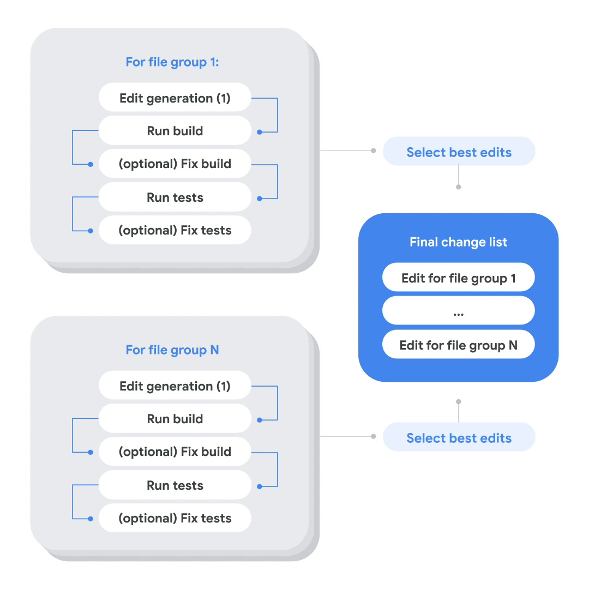

# AI 辅助软件工程：系统迁移

## 示例

### Google

[Accelerating code migrations with AI](https://research.google/blog/accelerating-code-migrations-with-ai/)

多年来，谷歌一直使用专门的基础设施来执行复杂的代码迁移。该基础设施使用静态分析和如 [Kythe](https://kythe.io/)
和 [Code Search](https://abseil.io/resources/swe-book/html/ch17.html)
等工具来发现需要更改的位置及其依赖关系。然后使用如 [ClangMR](https://clang.llvm.org/docs/RefactoringEngine.html) (Clang’s
refactoring engine)等工具进行更改。

这种方法对结构统一且边缘情况有限的更改效果很好。然而，当迁移具有复杂结构的代码时，静态分析和简单的迁移脚本会遇到限制——例如，改变接口及其在多个组件及其依赖中的使用，或更新其测试。

我们将迁移过程概念性地分为三个阶段：

- 确定需要修改的代码库位置
- 编辑生成和验证
- 更改审查和发布

虽然这些阶段中的每一个都受益于 AI，我们主要关注第 2 阶段。

为了生成和验证代码更改，我们利用了在谷歌内部代码和数据上微调过的 Gemini 模型版本。

每次迁移需要以下输入：

- 一组文件和预期更改的位置：路径 + 文件中的行号
- 一到两个描述更改的提示
- [可选] 少量示例，以确定文件是否确实需要迁移

多阶段代码迁移过程的示例执行。

用户提供的文件位置通过预先存在的静态工具和人工输入的组合进行收集。我们的迁移工具包会自动扩展这组文件，添加其他相关文件，包括：测试文件、接口文件和其他依赖项。
这一步骤尚未由 AI 驱动，但使用了符号交叉引用信息。

在许多情况下，用户提供的迁移文件集并不完美。由于过滤输入列表可能很繁琐，一些文件可能已经部分或完全迁移。因此，为了避免冗余更改或在编辑生成过程中混淆模型，
我们提供了少量示例，并要求模型预测文件是否需要迁移。

编辑生成和验证步骤是我们发现自动系统最有益的地方。我们的模型在谷歌的单体代码库和流程数据上按照 DIDACT 方法进行了训练。在推理时，
我们用自然语言指令以及模型的一般指令对每一行预计需要更改的地方进行标注。在每次模型查询中，输入上下文可以包含一个或多个相关文件。

模型然后预测文件之间的差异（diff），并且可以更改相关部分，以确保最终代码正确。

#### 案例研究：将整数从 32 位迁移到 64 位

随着谷歌代码库及其产品的演进，以前做出的假设（有时是在十多年前）已不再成立。例如，谷歌广告有数十种用于处理用户、商户、广告系列等的数字唯一“ID”类型，
这些ID最初定义为32位整数。但随着ID数量的增长，我们预计它们会比预期更早地溢出32位容量。

这一认识促使我们进行了将这些ID迁移到64位整数的重大工作。该项目困难重重，原因包括：

- 在数千个文件中的数万个位置使用这些ID。
- 如果每个团队都自己处理迁移，跟踪所有涉及团队的更改将非常困难。
- 这些ID通常定义为通用数字（C++中的int32_t或Java中的Integer），不是唯一的、易于搜索的类型，这使得通过静态工具查找它们的过程变得复杂。
- 需要在多个文件中考虑类接口的变化。
- 需要更新测试以验证64位ID是否被正确处理。

如果手动完成，这项工作预计需要许多年的软件工程时间。 为了加速工作，我们使用了 AI 迁移工具，并制定了以下工作流程：

1. 一位专家工程师识别出他们想迁移的 ID，并使用 Code Search、Kythe 和自定义脚本的组合，识别出需要迁移的（相对紧凑的）文件和位置超集。
2. 迁移工具包自动运行并生成经过验证的更改，这些更改仅包含通过单元测试的代码。某些测试本身也会更新以反映新的现实。
3. 工程师快速检查更改，并可能更新模型失败或出错的文件。然后，这些更改会被分片并发送给多个负责受更改影响的代码库部分的审查员。

请注意，内部代码库中使用的ID已经应用了适当的隐私保护。在将它们迁移到新类型时，模型不会更改或公开这些 ID，因此所有隐私保护措施将保持不变。

在这项工作流中，我们发现80%的代码修改是在AI的帮助下完成的，其余的是由人工完成的。根据执行迁移的工程师报告，总迁移时间减少了估计 50%。通信开销显著减少，
因为一个工程师可以生成所有必要的更改。工程师仍然需要花时间分析需要更改的文件和进行审查。我们发现，在 Java 文件中，我们的模型以 91% 的准确率预测了需要编辑的文件。

该工具包已经用于在此迁移和其他迁移中创建了数百个更改列表。平均而言，我们成功地将超过 75% 的 AI 生成的字符更改合并到单体代码库中。

### Ebay：定期维护和升级基础设施

《[Cutting Through the Noise: Three Things We've Learned About Generative AI and Developer Productivity](https://innovation.ebayinc.com/tech/features/cutting-through-the-noise-three-things-weve-learned-about-generative-ai-and-developer-productivity/)》

现有的开源大型语言模型有时会达到生产力的上限；毕竟，从一个不包含我们内部数据的模型中，我们能学到的东西是有限的。因此，第二条路径是使用我们组织预处理后的数据对开源的LLMs进行后期训练和微调。

在这个练习中，我们使用了Code Llama 13B作为基础LLM，不过如果有需要，也可以轻松替换成其他模型。为了看看后期训练和微调的现有
LLM 效果如何，
我们创建了一个我们称之为eBayCoder的模型：这是一个基于eBay代码库和相关文档训练的Code Llama。

那么效果如何呢？我们发现，eBayCoder能够显著简化一些之前劳动密集型且耗时的任务。例如，软件维护在所有技术组织中都至关重要。和其他大型公司一样，eBay
也有自己基于开源软件构建的基础库和框架，覆盖服务器、消息队列、批处理作业、iOS和Android等。这些系统需要定期升级，
以改进开发人员的工作体验并解决安全漏洞（例如升级到最新的Spring或Spring Boot版本）。这种工作量视当前应用栈的版本而定，有时甚至会非常庞大。
即使使用eBay现有的迁移工具，我们仍需投入大量工程资源进行软件维护。而这是我们认为微调后的LLM在短期内已经能够产生巨大影响的一个领域。

对于像eBay这样庞大且多样的代码库，我们有时也会遇到一个问题，即现有的商业LLM产品只能访问与当前问题直接相关的数据和代码，通常是周围的文件、
当前的代码库以及一些依赖库。它可能无法察觉到其他团队维护的不同内部服务或非依赖库中提供的相同功能。这往往导致大量的代码重复。
但一个微调后的LLM可以访问我们希望的尽可能多的上下文，从而有可能减少代码重复的数量。

### Amazon 遗留基础设施改造

许多组织面临维护关键遗留Java应用程序的挑战，这些应用程序由于框架过时、代码无文档和安全漏洞而变得难以维护。现代化这些应用程序是必要且具有挑战性的任务。Amazon
Q Developer简化并加速了这一过程。

**使用Amazon Q Developer的现代化过程**

1. **升级Java版本：**
    - 从Java 8升级到Java 17，以提高性能、安全性并利用新功能。
    - Amazon Q Developer代码转换代理通过分析代码、生成转换计划并更新框架和库以兼容Java 17来自动化这一过程。

2. **减少技术债务：**
    - 识别并解决代码库中的技术债务，以提高代码质量和可维护性。
    - 使用Amazon Q Developer生成技术债务问题列表并提出改进建议。
    - 实施建议，如改进日志记录和模块化，以减少技术债务。

3. **云原生部署：**
    - 将应用程序迁移到云原生架构并部署到AWS。
    - 步骤包括将应用程序容器化，使用Amazon Elastic Container Registry（ECR），在AWS Fargate上部署到Amazon Elastic Container
      Service（ECS），并设置Amazon CloudWatch进行监控。
    - Amazon Q Developer帮助生成用于容器化的Dockerfile和用于基础设施部署的CloudFormation模板。

